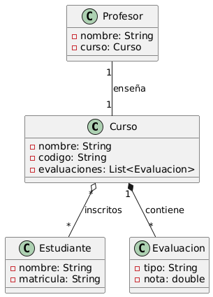

# Java 21 + Spring Boot Backend Developer

## Objetivo

Facilitar el aprendizaje progresivo para personas que están iniciando en el desarrollo `backend` con Java, integrando buenas prácticas, tecnologías actuales y fundamentos sólidos.

---

Para poder abordar de manera correcta al desarrollo `backend` con java, es necesario conocer los conceptos básicos y necesarios para poder entender los tópicos que se enumeran a continuación:

# 📘 Módulo 0: Introducción a la programación y al lenguaje Java

- ¿Qué es un lenguaje de programación?
    
    A un lenguaje de programación podríamos definirlo como un lenguaje formal que por medio de instrucciones permite el desarrollo de algoritmos que interactúen con el so
    
- Variables, condicionales, ciclos, funciones.
    - Variables: las variables podríamos definirlo como un lugar en el que podemos guardar algo, estas variables en algunos lenguajes manejan tipos de datos.
    - Condicionales: las estructuras condicionales son aquellas que durante le ejecución del algoritmo permite cambiar la ejecución del algoritmo en base a condiciones.
    - Ciclos: los ciclos o bucles son estructuras repetitivas que permite realizar tareas repetitivas en algoritmos.
    - Funciones: las funciones permiten definir lógica reutilizable, en alguno java estas funciones deben retornar un valor o tambien no, todo dependerá de como se baya a definir.
- Introducción a la JVM y JDK.
    - JVM: Es la maquina virtual de java es decir el compilador, lo cual permite ejecutar código java, de hay nace la frase “escribe una sola ves y ejecuta en cualquier lugar”.
    - JDK: Es el kit de desarrollo de java, es el lugar donde se encuentran todas las utilizades de java.

---

# 🧱 Módulo 1: Fundamentos de Programación Orientada a Objetos (POO)

La POO es uno de los paradigmas más importantes que se utiliza para el desarrollo de software, entonces es fundamental entender sus conceptos básicos, entender los pilares fundamentales.

- Clases y Objetos
    - Clases: Podremos definir una clase como un molde que nos permite crear objetos, estas clases pueden tener atributos, métodos (acciones)
    - Los objetos no son más que instancias de clases
- Encapsulamiento, Herencia, Polimorfismo, abstracción
    
    Estas son los tres pilares fundamentales de la POO, entonces vayamos definiendo cada uno de ellos:
    
    - Encapsulamiento: Permite ocultar algunos detalles internos de un objeto (`atributos`) privados y expone solo lo necesario mediante métodos públicos (`get` y `set`),
        
        ```java
        // 🔒 La variable contraseña está protegida, y solo se puede acceder mediante el método verificarContraseña.
        public class Usuario {
            private String contraseña;
        
            public Usuario(String contraseña) {
                this.contraseña = contraseña;
            }
        
            public boolean verificarContraseña(String input) {
                return input.equals(this.contraseña);
            }
        }
        
        ```
        
    - Polimorfismo: El polimorfismo es una de las cosas más fascinantes que se puede logras con la POO, podemos definirlo con lo siguiente `muchas formas` es decir, permite que diferentes clases respondan al mismo método, pero de forma distinta
        
        ```java
        interface Notificador {
            void enviar(String mensaje);
        }
        
        public class Email implements Notificador {
            public void enviar(String mensaje) {
                System.out.println("Enviando email: " + mensaje);
            }
        }
        
        public class SMS implements Notificador {
            public void enviar(String mensaje) {
                System.out.println("Enviando SMS: " + mensaje);
            }
        }
        ```
        
    - Herencia: La herencia nos permite simular una estructura jerárquica en el desarrollo de software, es decir permite que una clase hija herede todas las propiedades y métodos de una clase padre. para poder hacer referencia a la clase padre se usa `super`
        
        ```java
        public class Animal {
            public void mover() {
                System.out.println("El animal se mueve");
            }
        }
        
        // 🐶 Perro hereda el método mover() de Animal y añade su propio comportamiento.
        public class Perro extends Animal {
            public void ladrar() {
                System.out.println("Guau!");
            }
        }
        ```
        
    - Abstracción: Permite esconder la complejidad interna y solo expone lo esencial
        
        ```java
        🧩 La clase abstracta define el contrato, y las clases concretas lo implementan según sus necesidades.
        abstract class BaseDeDatos {
            abstract void conectar();
        }
        
        public class MongoDB extends BaseDeDatos {
            public void conectar() {
                System.out.println("Conectando a MongoDB...");
            }
        }
        ```
        
- Interfaces y clases abstractas
    
    Estos conceptos son fundamentales, podemos definir las interfaces y las clases abstractas como contratos, es decir las todas las clases que implementen a una de estas tienen la obligación de darle un comportamiento a los métodos que las interfaces y clases abstractas definen.
    
    Tanto las interfaces y clases abstractas no son iguales algunas de las diferencias claves son:
    
    | Característica | Clase Abstracta | Interfaz |
    | --- | --- | --- |
    | Herencia | Solo se puede heredar de una clase abstracta | Se pueden implementar múltiples interfaces |
    | Métodos | Puede tener métodos abstractos y concretos | Solo métodos abstractos (desde Java 8, también default y static) |
    | Atributos | Puede tener atributos con cualquier modificador | Solo constantes (`public static final`) |
    | Constructores | Puede tener constructores | No puede tener constructores |
    | Modificadores de acceso | Métodos pueden ser `public`, `protected` | Todos los métodos son `public` |
    | Uso típico | Base común con lógica compartida | Contrato que define comportamiento |
    
    Su uso se da en los siguientes casos:
    
    - Una clase abstracta suele usarse varias clases comparten lógica común y además de ello necesitan una base de métodos ya implementados
        
        ```java
        // Figura define un método abstracto y uno concreto. Cuadrado implementa el cálculo específico.
        abstract class Figura {
            abstract float calcularArea();
        
            public void mostrarTipo() {
                System.out.println("Soy una figura geométrica");
            }
        }
        
        class Cuadrado extends Figura {
            private float lado;
        
            public Cuadrado(float lado) {
                this.lado = lado;
            }
        
            public float calcularArea() {
                return lado * lado;
            }
        }
        ```
        
    - Una interfaz permite definir solo métodos o también llamados contratos y las clases que lo implemente están en la obligación de cumplirlo sin compartir la implementación.
        
        ```java
        // Notificador define el contrato. Cada clase lo implementa a su manera.
        interface Notificador {
            void enviar(String mensaje);
        }
        
        class Email implements Notificador {
            public void enviar(String mensaje) {
                System.out.println("Enviando email: " + mensaje);
            }
        }
        
        class SMS implements Notificador {
            public void enviar(String mensaje) {
                System.out.println("Enviando SMS: " + mensaje);
            }
        }
        ```
        
        estas interfaces podemos clasificarlo en dos:
        
        - Interfaces funcionales: Estas interfaces solo definen un solo método abstracto, a usarlo nos da una facilidad de usarlo usando expresiones lambda o referencias a métodos estos conceptos se profundizarán más en la sección de programación funcional
            
            ```java
            // La anotación @FunctionalInterface no es obligatoria, pero ayuda a que el compilador verifique que la interfaz cumple con la regla.
            @FunctionalInterface
            interface Operacion {
                int apply(int a, int b);
            }
            ```
            
            - Su uso es ideal para programación funcional, callbacks, Streams, y APIs modernas.
        - Interfaces no funcionales: Este tipo de interfaces son lo contrario, es decir definen a más de un método abstracto
            
            ```java
            interface Operaciones {
                int sumar(int a, int b);
                int restar(int a, int b);
            }
            ```
            
            - Útil para definir contratos más complejos, como en arquitecturas orientadas a servicios o patrones como Strategy.
- Asociaciones entre clases (UML → código Java)
    - Tipos de asociaciones UML y su equivalente en Java
    
    | Tipo de relación | UML (símbolo) | Java (implementación) |
    | --- | --- | --- |
    | Asociación | Línea simple | Atributo con tipo de otra clase |
    | Agregación | Línea con rombo vacío | Atributo con tipo de otra clase (sin dependencia fuerte) |
    | Composición | Línea con rombo lleno | Atributo con tipo de otra clase (con dependencia fuerte) |
    | Herencia | Flecha con triángulo | `extends` entre clases |
    | Implementación | Línea punteada | `implements` entre clase e interfaz |
    | Dependencia | Flecha punteada | Uso temporal de otra clase (como parámetro o método) |
    
    Fuente: [Visual Paradigm Blog Español](https://blog.visual-paradigm.com/es/what-are-the-six-types-of-relationships-in-uml-class-diagrams/)
    
    - Ejemplos en Java
        - 1. Asociación (↔)
            
            ```java
            public class Profesor {
                private Curso curso; // Asociación: un profesor tiene un curso
            }
            ```
            
        - 2. Agregación (◇)
            
            ```java
            public class Departamento {
                private List<Profesor> profesores; // Agregación: los profesores pueden existir sin el departamento
            }
            ```
            
        - 3. Composición (◆)
            
            ```java
            public class Casa {
                private Habitacion habitacion; // Composición: si la casa se destruye, la habitación también
            }
            ```
            
        - 4. Herencia (△)
            
            ```java
            public class Animal {
                public void mover() {}
            }
            
            public class Perro extends Animal {
                public void ladrar() {}
            }
            ```
            
        - 5. Implementación (⋯)
            
            ```java
            interface Volador {
                void volar();
            }
            
            public class Pajaro implements Volador {
                public void volar() {
                    System.out.println("El pájaro vuela");
                }
            }
            ```
            
        - 6. Dependencia (→)
            
            ```java
            public class ServicioEmail {
                public void enviarMensaje(Usuario usuario) {
                    // Usa Usuario temporalmente
                }
            }
            ```
            
    - ¿Cómo modelarlo en UML?
        - **Clase A tiene una referencia a Clase B** → Asociación (↔)
        - **Clase A contiene objetos de Clase B, pero B puede vivir sin A** → Agregación (◇)
        - **Clase A contiene objetos de Clase B, y B depende del ciclo de vida de A** → Composición (◆)
        - **Clase B extiende A** → Herencia (△)
        - **Clase B implementa interfaz A** → Implementación (⋯)
        - **Clase A usa Clase B como parámetro o variable local** → Dependencia (→)
    - Un Ejemplo más elaborado
        
        
        
    - Traducción a codigo
        - Relación entre clases
            - `Curso` **compone** `Evaluacion` → si el curso se elimina, las evaluaciones también.
            - `Profesor` **asociado** a un `Curso` → relación directa.
            - `Curso` **agrega** `Estudiantes` → los estudiantes existen independientemente del curso.
        
        ### `Curso.java`
        
        ```java
        public class Curso {
            private String nombre;
            private String codigo;
            private List<Evaluacion> evaluaciones = new ArrayList<>();
        
            public void agregarEvaluacion(Evaluacion eval) {
                evaluaciones.add(eval);
            }
        }
        
        ```
        
        ### `Profesor.java`
        
        ```java
        public class Profesor {
            private String nombre;
            private Curso curso;
        
            public Profesor(String nombre, Curso curso) {
                this.nombre = nombre;
                this.curso = curso;
            }
        }
        
        ```
        
        ### `Estudiante.java`
        
        ```java
        public class Estudiante {
            private String nombre;
            private String matricula;
        
            public Estudiante(String nombre, String matricula) {
                this.nombre = nombre;
                this.matricula = matricula;
            }
        }
        
        ```
        
        ### `Evaluacion.java`
        
        ```java
        public class Evaluacion {
            private String tipo;
            private double nota;
        
            public Evaluacion(String tipo, double nota) {
                this.tipo = tipo;
                this.nota = nota;
            }
        }
        
        ```
        
        ---
        
- Introducción a pruebas con JUnit (tests simples de lógica de clases)
    
    Testing es otro mundo, pero solo hablaremos de testing en java con JUnit, es ideal para verificar la lógica de clases y detectar errores.
    
    - Estructura básica de una prueba
        
        El patrón típico es **AAA**:
        
        1. **`Arrange`**: Preparar los datos y objetos.
        2. **`Act`**: Ejecutar el método que se quiere probar.
        3. **`Assert`**: Verificar que el resultado sea el esperado.
    - Veamos un ejemplo
        
        ```java
        public class Calculadora {
            public int sumar(int a, int b) {
                return a + b;
            }
        
            public int dividir(int a, int b) {
                if (b == 0) throw new IllegalArgumentException("No se puede dividir por cero");
                return a / b;
            }
        }
        ```
        
        Test
        
        ```java
        import org.junit.jupiter.api.Test;
        import static org.junit.jupiter.api.Assertions.*;
        
        public class CalculadoraTest {
        
            @Test
            public void testSuma() {
                Calculadora calc = new Calculadora();
                assertEquals(5, calc.sumar(2, 3));
            }
        
            @Test
            public void testDivision() {
                Calculadora calc = new Calculadora();
                assertEquals(2, calc.dividir(4, 2));
            }
        
            @Test
            public void testDivisionPorCero() {
                Calculadora calc = new Calculadora();
                assertThrows(IllegalArgumentException.class, () -> calc.dividir(4, 0));
            }
        }
        
        ```
        
    - Algunos de los métodos más usados son:
        
        
        | Método | Propósito |
        | --- | --- |
        | `assertEquals(a, b)` | Verifica que `a == b` |
        | `assertTrue(cond)` | Verifica que la condición es verdadera |
        | `assertFalse(cond)` | Verifica que la condición es falsa |
        | `assertThrows()` | Verifica que se lanza una excepción |
        | `assertNull(obj)` | Verifica que el objeto es `null` |

---

# ⚙️ Módulo 2: Ecosistema de Java - Maven y Lombok

- ¿Qué es Maven y para qué sirve?
    
    Es una herramienta de gestión de proyectos y automatización permite simplificar el siclo de vida del desarrollo de sofware, desde la compilación, empaquetado y despliegue.
    
    Maven sirve para:
    
    - Gestionar dependencias desde repositorios provenientes de Maven central
    - Permite compilar y empaquetar el código en archivos `.jar` o `.war`
    - Permite ejecutar comandos para correr las pruebas, generar documentación e instalar artefactos
    - Permite estandarizar la estructura del proyecto
- Creación de un proyecto con Maven
    
    Estructura de un proyecto
    
    ```
    mi-proyecto/
    ├── pom.xml
    └── src/
        ├── main/
        │   └── java/
        └── test/
            └── java/
    ```
    
    El comando para poder crear un nuevo proyecto es
    
    ```java
    mvn archetype:generate -DgroupId=com.kevin.app -DartifactId=mi-proyecto -DarchetypeArtifactId=maven-archetype-quickstart -DinteractiveMode=false
    ```
    
    - Donde:
        - `groupId`: Identificador del grupo (como el nombre del paquete base).
        - `artifactId`: Nombre del proyecto.
        - `archetypeArtifactId`: Plantilla base (quickstart incluye estructura básica con clase Main y test).
        - `interactiveMode=false`: Evita preguntas interactivas.
    - Comandos
        
        
        | Comando | Propósito | Ejemplo de uso |
        | --- | --- | --- |
        | `mvn clean` | Elimina la carpeta `target` y limpia el proyecto | `mvn clean` |
        | `mvn compile` | Compila el código fuente Java | `mvn compile` |
        | `mvn test` | Ejecuta las pruebas unitarias con JUnit | `mvn test` |
        | `mvn package` | Compila y empaqueta el proyecto en un `.jar` o `.war` | `mvn package` |
        | `mvn install` | Instala el artefacto en el repositorio local | `mvn install` |
        | `mvn verify` | Ejecuta pruebas de integración y verifica el proyecto | `mvn verify` |
        | `mvn site` | Genera documentación del proyecto | `mvn site` |
        | `mvn dependency:tree` | Muestra el árbol de dependencias | `mvn dependency:tree` |
        | `mvn exec:java` | Ejecuta una clase Java con `main()` | `mvn exec:java -Dexec.mainClass="com.kevin.Main"` |
        |  | Ejecutar el proyecto | `java -jar target/mi-proyecto-1.0-SNAPSHOT.jar` |
- Lombok y sus anotaciones: @Getter, @Setter, @Data, @Builder...
    
    Lombok es una librería de java, que permite eliminar el código repetitivo en clases modelo (`POJOs`), esto por medio de decoradores, estas se integran en tiempo de compilación para generar 
    `getters`, `setters`, `constructores`, `equals()`, `hashCode()`, `toString()` y más.
    
    Ejemplo
    
    Sin lombok: Es necesario generar todo lo necesario para que la clase funcione
    
    ```java
    public class Usuario {
        private String nombre;
        private int edad;
    
        public Usuario() {}
        public String getNombre() { return nombre; }
        public void setNombre(String nombre) { this.nombre = nombre; }
        public int getEdad() { return edad; }
        public void setEdad(int edad) { this.edad = edad; }
    }
    
    ```
    
    Con lombok: Al usarlo con el decorador @Data, esta generara automáticamente los `Getters` y `setters` `toString()` `equals()` y `hashCode()` Constructor sin argumentos o con argumentos
    
    ```java
    import lombok.Data;
    
    @Data
    public class Usuario {
        private String nombre;
        private int edad;
    }
    
    ```
    
    Anotaciones principales
    
    | `@Getter/@Setter` | Genera getters y setters |
    | --- | --- |
    | `@Data` | Todo en uno: getters, setters, `toString`, etc. |
    | `@NoArgsConstructor` | Constructor sin argumentos |
    | `@AllArgsConstructor` | Constructor con todos los campos |
    | `@Builder` | Patrón builder para instanciación flexible |
    | `@Value` | Clase inmutable (campos `final`) |

---

# 🌀 Módulo 3: Colecciones, Genéricos y Programación Funcional

Para esta sección se espera que ya domines los conceptos básicos, entonces definamos antes que son las colecciones, genéricos y que es la programación funcional:

## Colecciones

Las colecciones son estructuras que nos permiten almacenar y manipular grupos de objetos

### Interfaces principales

- List
    - **Características:**
        - Permite elementos duplicados.
        - Mantiene el orden de inserción.
        - Acceso por índice.
    - **Implementaciones comunes:**
        - `ArrayList`: basada en un array dinámico; acceso rápido por índice, lenta para inserciones intermedias.
        - `LinkedList`: lista doblemente enlazada; inserciones/eliminaciones rápidas en posiciones intermedias, acceso secuencial.
        - `Vector`: similar a `ArrayList` pero sincronizado (menos eficiente en entornos monohilo).
    - **Ejemplo:**
        
        ```java
        List<String> nombres = new ArrayList<>();
        nombres.add("Ana");
        nombres.add("Luis");
        nombres.add("Ana"); // duplicados permitidos
        System.out.println(nombres.get(1)); // "Luis"
        ```
        
- Set
    - **Características:**
        - No permite elementos duplicados.
        - No garantiza un orden específico (excepto implementaciones ordenadas).
    - **Implementaciones comunes:**
        - `HashSet`: basado en tabla hash; no garantiza orden.
        - `LinkedHashSet`: mantiene orden de inserción.
        - `TreeSet`: mantiene elementos ordenados según `Comparable` o `Comparator`.
    - **Ejemplo:**
        
        ```java
        Set<Integer> numeros = new HashSet<>();
        numeros.add(3);
        numeros.add(1);
        numeros.add(3); // ignorado
        System.out.println(numeros); // orden no garantizado
        ```
        
- Map
    - **Características:**
        - Almacena pares clave-valor.
        - No permite claves duplicadas; los valores pueden repetirse.
    - **Implementaciones comunes:**
        - `HashMap`: rápido, no garantiza orden.
        - `LinkedHashMap`: mantiene orden de inserción.
        - `TreeMap`: ordena según las claves.
    - **Ejemplo:**
        
        ```java
        Map<String, Integer> edades = new HashMap<>();
        edades.put("Ana", 30);
        edades.put("Luis", 25);
        System.out.println(edades.get("Ana")); // 30
        ```
        
- Sus usos comunes
    
    ### **List**
    
    - Ideal para colecciones donde importa el orden.
    - Útil cuando se requieren accesos por índice.
    
    ### **Set**
    
    - Útil para eliminar duplicados.
    - Ideal para búsquedas rápidas de pertenencia.
    
    ### **Map**
    
    - Para asociaciones clave-valor.
    - Uso común en conteo de frecuencias o configuración.
- Colecciones inmutables
    - Desde Java 9:
        
        ```java
        List<String> listaInmutable = List.of("A", "B");
        Set<Integer> setInmutable = Set.of(1, 2, 3);
        Map<String, String> mapInmutable = Map.of("clave", "valor");
        ```
        

## Genéricos

Los genéricos nos permiten definir clases y funciones con tipos de datos parametrizado permitiendo mantener la seguridad de tipos, es decir supongamos que quiero declarar una función, pero esta función debe recibir atributos y también se le debe dar el tipo de dato que esta retornara, pero no sé cuál es entonces le indicamos que tome una letra genérica, entonces toma esta `T` (genérico) y en la implementación te pasare el tipo de dato adecuado

Al usar genéricos garantizamos:

- **Seguridad de tipos:** Previene errores en tiempo de compilación evitando conversiones inseguras.
- **Reutilización de código:** Un mismo método o clase funciona con múltiples tipos.
- **Legibilidad y mantenibilidad:** El tipo esperado queda claro al usarlo.

Hagamos una comparativa de una implementación usando genéricos y sin genéricos

- **Ejemplo sin genéricos:**
    
    ```java
    List lista = new ArrayList();
    lista.add("Hola");
    String texto = (String) lista.get(0); // Necesita casting
    ```
    
- **Ejemplo con genéricos:**
    
    ```java
    List<String> lista = new ArrayList<>();
    lista.add("Hola");
    String texto = lista.get(0); // No necesita casti
    ```
    

### Sintaxis Basica

Para hacer referencia a los parámetros de tipo estas deben de ir entre `<>` , las letras que generalmente se usan son:

- `T` → *Type* (tipo genérico)
- `E` → *Element* (colecciones)
- `K` → *Key*, `V` → *Value* (Mapas)
- `N` → *Number*

Veamos un ejemplo de una clase genérica

```java
public class Caja<T> { // T es el parametro de tipo
    private T contenido;

    public void guardar(T valor) {
        this.contenido = valor;
    }

    public T obtener() {
        return contenido;
    }
}

Caja<String> cajaDeTexto = new Caja<>();
cajaDeTexto.guardar("Hola");
System.out.println(cajaDeTexto.obtener());
```

### **Bounded Type Parameters**

Los parámetros de tipo con limite que es como se le conoce a esto es una de las partes más interesantes que se puede lograr con la programación genérica, pongamos este caso de uso para su correcta compresión.

Tenemos una caja en donde podemos guardar lo que queramos (cuadernos, juguetes, monedas, etc), pero a usar los **`Bounded Type Parameters`** nosotros podemos definir reglas es decir nosotros podemos especificar que en esta caja solo se aceptan Perritos o sus subtipos (herencia). A esto lo conocemos como **`Bounded Type Parameters`** cajas genéricas que solo aceptan ciertos tipos y esto los clasificamos en dos:

- `Upper Bound` — Límite Superior (`extends`)
    
    Al usar esta clasificación en código podemos decir que esta cajita generica puede aceptar animales o cosas que sean subtipos de animal (gatitos o perritos), veamos un ejemplo
    
    ```java
    
    class Caja<T extends Animal> {
        T contenido;
    }
    ```
    
    En el ejemplo T tiene restricciones, en este caso T solo puede Gato, Perro; pero no puede ser algo que no esté relacionado con Animal por decir Auto
    
    Muy útil para usar metodos comunes para todos aquellos que se encuentran dentro de la cajita
    
- `Lower Bound` — Límite Inferior (`super`) con wildcard
    
    Esta clasificación es similar pero lo contrario del anterior, retomemos la cajita magica en donde podemos almacenar Fotos, pero al usar `Lower Bound` podemos guardar cualquier cosa que se mas general a Fotos por ejemplo Documentos, por ejemplo, si hacemos `List<? super Foto>` entonces podemos guardar fotos, pero no una foto con firma que está ya llegar a ser un subtipo de Foto, pero si podemos guardar otro tipo de archivo que este más arriba de Foto si simulamos una estructura jerárquica.
    
    Entonces restringe a un tipo especifico o sus supertipos, veamos un ejemplo
    
    ```java
    public static void addNumbers(List<? super Integer> list) {
      for (int i = 1; i <= 10; i++) {
        list.add(i);
      }
    }
    
    ```
    
    La lista puede ser de tipo `Integer`, `Number` o `Object` y aun así podemos agregar o guardar números sin problema
    

En java casi todo está construido bajo genéricos, las colecciones en Java están definidas usando genéricos (`List<T>`, `Set<T>`, `Map<K,V>`), al usarlo nos permite evitar errores de tipo `ClassCastException` en tiempo de ejecución.

### Limitaciones y buenas practicas

- Limitaciones:
    - No se pueden crear instancias de tipos genéricos `new T()` —> error
    - No se pueden usar tipos primitivos tales como (`int`, `double`, `float`) solo `Object`
- Buenas prácticas:
    - Se recomienda usar nombres significativos si se conoce bien el contexto y como lo requiera por ejemplo usar `<User>` en lugar de `<T>`
    - Preferir **upper bounds** para lectura y **lower bounds** para escritura:
        - **PECS (Producer Extends, Consumer Super)**: *Producer → extends*, *Consumer → super*.
            - **Producer Extends**: Si una colección solo va a **producir** datos (es decir, vas a **leer** elementos), utiliza `<? extends T>`.
                
                Imaginemos que tenemos una lista que solo será de lectura
                
                ```java
                void procesar(List<? extends Animal> lista) { … }
                ```
                
                En el ejemplo anterior podemos pasarle una lista a la función por ejemplo pasar `List<Perro>` o `List<Gato>` (ya que `Perro` y `Gato` son subtipos de `Animal`), y de la lista puedes leer sin problemas como `Animal`. Sin embargo, **no puedes añadir nada** (excepto `null`)
                
            - **Consumer Super**: Si una colección solo va a **consumir** datos (es decir, vas a **añadir** elementos), utiliza `<? super T>`. Imaginemos una lista en las cual es de escritura, entonces podemos defirnirlo como
                
                ```java
                void agregarPerros(List<? super Perro> lista) {
                    lista.add(new Perro());
                }
                ```
                
                Aquí podemos pasar `List<Perro>`, `List<Animal>` o incluso `List<Object>`. Puedes añadir un `Perro` sin problema, pero al **leer**, solo obtendrás `Object`, porque el compilador no sabe qué tipo exacto contiene la lista.
                
            
            > "Si solo está extrayendo elementos de una colección genérica, es un productor y debe usar extensiones; si solo está insertando elementos, es un consumidor y debe usar super
            > 
            - Para métodos que **producen** (retornan datos): usar `extends`.
            - Para métodos que **consumen** (aceptan datos): usar `super`.
            
            Lectura
            
            https://www.cs.rice.edu/~javaplt/nv4/pecs/?utm_source=chatgpt.com
            
            https://www.baeldung.com/java-generics-pecs?utm_source=chatgpt.com
            
            Vemos un ejemplo mas elaborado
            
            ```java
            public static <T extends Comparable<? super T>> T maximo(List<T> lista) {
                T max = lista.get(0);
                for (T elem : lista) {
                    if (elem.compareTo(max) > 0) {
                        max = elem;
                    }
                }
                return max;
            }
            
            // Pregunta esto es un productor o consumidor ?
            ```
            

## Programación Funcional

### ¿Qué es la Programación Funcional?

Es un paradigma que considera la computación como la evaluación de funciones matemáticas, evitando estado mutable y efectos secundarios. 

La programación funcional es declarativa en lugar de imperativa es decir la forma imperativa se centra en cómo se hace, pero la declarativa se centra solo en el resultado.

Haciendo una comparativa con la POO en donde el estado se comparte dentro de objetos; en la programación funcional el estado fluye a través de funciones puras.

### ¿Que es lo que marca su llegada?

La llegada de la programación funcional es a partir de java 8 donde se introduce lo siguiente:

- Se introduce un nuevo paquete `java.util.function` que contiene interfaces funcionales, aquí la documentación https://docs.oracle.com/javase/8/docs/api/java/util/function/package-summary.html
- Se introduce las funciones lambda y referencias de métodos
- Ejemplo con `Predicate`:
    
    Un ejemplo es la interfaz funcional `Predicate` que tiene un método `test(T t)` que devuelve un valor booleano. Esta interfaz se puede usar para expresiones lambda y referencias de métodos.
    
    ```java
    public interface Predicate<T> {
    		boolean test(T t);	
    }
    
    public class Example{    
    		public static void main(String[] args) {        
    				Predicate<String> predicate = (s) -> !s.isEmpty();        
    				predicate.test("foo");              // true        
    				predicate.negate().test("foo");     // false  
    				// Referencia a metodos con ::
    				Predicate<Boolean> nonNull = Objects::nonNull;      
    				Predicate<Boolean> isNull = Objects::isNull;        
    				Predicate<String> isEmpty = String::isEmpty;        
    				Predicate<String> isNotEmpty = isEmpty.negate();    
    		}
    }
    ```
    

### Interfaces funcionales

Es una interfaz con un solo método abstracto o también conocido como SAM – `*Single Abstract Methoh`* , estas interfaces se usan para representar funciones como objetos, un ejemplo muy claro es el anterior ya que solo tiene un método abstracto lo cual es `test(T t)` recordemos que `T` es un genérico

### Expresiones Lambda

Son funciones anónimas como generalmente se los conoce esto es debido a que no necesitan un nombre, estas son bloques cortos de código donde se les pueden enviar parámetros y que retornen un valor.

Ahora para poder entender el concepto de la programación funcional es importante tomar en cuentas los siguientes conceptos:

Ejemplo de sintaxis básica es `(parametros) -> {cuerpo}`

- Funciones
    
    Son bloques de código reutilizables que reciben entradas, los procesan y devuelven un valor
    
- Inmutabilidad
    
    La inmutabilidad se refiere a que el estado de un objeto debe permanecer inmutable, es decir no se puede modificar después de su creacion, esto nos da una ventaja lo cual es evitar los efectos secundarios.
    
    ```java
    List<String> nombres = List.of("Juan", "Ana"); // esto es inmutable
    ```
    
- Funciones como ciudadanos de primera clase
    
    Se les llama de esta manera porque estas mismas funciones tienen la capacidad de:
    
    - Asignarse a una variable:  Puedes asignar una función a una variable, de manera similar a como asignas un valor entero o una cadena.
        
        ```java
        Function<Integer, Integer> cuadrado = x -> x * x;
        ```
        
    - Pasarse como parámetro o argumento
        
        ```java
        public static void procesarNumero(int numero, Function<Integer, Integer> operacion) {    
        		int resultado = operacion.apply(numero);    
        		System.out.println("Resultado: " + resultado);
        }
        // Uso
        procesarNumero(5, cuadrado);
        ```
        
    - Devolver funciones
        
        ```java
        public static Function<Integer, Integer> obtenerFuncion(boolean doblar) {    
        		if (doblar) {        
        				return x -> x * 2;    
        		} else {        
        				return x -> x + 5;    
        		}
        }
        // Uso
        Function<Integer, Integer> funcion = obtenerFuncion(true);
        int resultado = funcion.apply(3);
        ```
        
    - Guardarse en colecciones
        
        ```java
        List<Function<Integer, Integer>> operaciones = new ArrayList<>();
        operaciones.add(x -> x * 2);
        operaciones.add(x -> x + 5);
        // Uso
        int resultado1 = operaciones.get(0).apply(3);  // resultado1 = 6
        int resultado2 = operaciones.get(1).apply(3);  // resultado2 = 8
        ```
        
    
    Este enfoque es parte fundamental de la programación funcional y permite escribir código más modular, reutilizable y expresivo en Java
    
- Funciones puras e impuras
    - Puras
        
        Se les denomina funciones puras a aquellos que son deterministas no generan efectos secundarios y además de ello si cumplen con uno de los principios `SOLID` lo cual es el SRP (`Una unica responsavilidad`)
        
    - Impuras
        
        Estas funciones son aquellas que dependen de un estado externo o en todo caso modifican el estado
        

<aside>
💡

Estos conceptos son la clave para poder entender la progrmacion funcional

</aside>

### **SAM y `@FunctionalInterface`**

Estos dos terminos van de la mano y se definen de la siguiente manera:

- **SAM:** Interfaz con un solo método abstracto.
- `@FunctionalInterface`: indica que la interfaz es funcional.

### **Operador de Referencia (`::`)**

Es un operador que se introdujo para poder simplificar las expresiones lambda utilizados comúnmente con interfaces funcionales

Tipos:

1. Método estático: `Integer::parseInt` (Puedes referenciar un método estático utilizando el nombre de la clase que lo contiene)
    
    ```java
    // Expresión lambda
    Function<String, Integer> parseInt = s -> Integer.parseInt(s);
    // Operador de referencia a método estático
    Function<String, Integer> parseIntRef = Integer::parseInt;
    ```
    
2. Método de instancia: `objectOfClass::metodo` (Puedes referenciar un método de instancia de un objeto específico utilizando el nombre del objeto seguido por el doble colon y el nombre del método.)
    
    ```java
    // Expresión lambda    
    BiPredicate<String, String> startsWith = (s1, s2) -> s1.startsWith(s2);
    // Operador de referencia a método de instancia
    BiPredicate<String, String> startsWithRef = String::startsWith;
    ```
    
3. Método de tipo arbitrario: `String::toUpperCase`
    
    ```java
    // Expresión lambda
    Comparator<String> lengthComparator = (s1, s2) -> s1.length() - s2.length();    
    // Operador de referencia a método de instancia de tipo arbitrario
    Comparator<String> lengthComparatorRef = Comparator.comparing(String::length);
    ```
    
4. Constructor: `ArrayList::new` (Puedes referenciar un constructor utilizando el nombre de la clase seguido por `::` y `new`)
    
    ```java
    // Expresión lambda
    Supplier<List<String>> listSupplier = () -> new ArrayList<>();
    // Operador de referencia a constructor
    Supplier<List<String>> listSupplierRef = ArrayList::new;
    ```
    

Veamos un ejemplo

```java
// Supongamos que tenemos esta lista
List<String> names = List.of("Juan", "Kevin", "Azrael", "Iris");

// para poder iterar esta lista podemos hacerlo de cualquier forma
names.forEach(name -> System.out.println(name)); // con un funcion lambda
names.forEach(System.out::println); // con el operador de referencia
```

### Inferencia de tipos

A partir de java 10, java tiene soporte a este poder (Inferencia de tipos), es decir en java ya no es necesario indicarle que tipos de dato es el que tendrá una variable con la palabra reservada `var` java infiere cual es el tipo de dato que tiene dicha variable con ver que valor tiene, a partir de valor el compilador en tiempo de ejecución deduce el tipo de variable

```java
List<String> listaDeCadenas = new ArrayList<String>(); // sin inferencia de tipos
var lista = new ArrayList<String>(); // con inferencia de tipos
```

### **Dándole nombre a un viejo amigo: `Chaining`**

Se le denomina de esta manera a la práctica de encadenar varios metodos u operaciones, a menudo se le asocia con otro de los conceptos fundamentales lo cual es el `pipelining` o también conocido como composición de funciones. Su funcionamiento es sencillo, llamas a una función y el resultado que te retorna esta función ya no lo guardas en un lugar, al contrario, con el `chaining` puede pasárselo directamente como entrada a otra función y de esta manera seguir hasta que consigas lo que quiere.

```java
List.of("Ana", "María", "Juan", "Kevin", "Azrael", "Iris")
    .stream() // comvierte la lista en un stream es decir un flujo continuo de datos
    .filter(n -> n.length() > 3) // filtra solo a aquellos nombres donde su longitud sea mayor que 3
    .map(String::toUpperCase)// convierte a todo los nombres en mayuculas (tranformacion)
    .forEach(System.out::println);// finalmente los vemos por consola
```

### Entendiendo la composición de funciones

La API de `Streams` en Java es un buen ejemplo de cómo se puede aplicar el “`pipelining`” para operaciones de procesamiento de datos en colecciones.

Aplicar funciones secuencialmente (`andThen`, `compose`).

```java
Function<Integer, Integer> doble = x -> x * 2;
Function<Integer, Integer> masTres = x -> x + 3;
Function<Integer, Integer> combinado = doble.andThen(masTres);
```

- Interfaces de `java.util.function` (principales)
    - `Predicate<T>` → `boolean test(T)`
        - **Propósito:** Evalúa un predicado sobre un solo argumento de tipo T y devuelve un valor booleano.
        - **Uso:** Se utiliza para realizar pruebas y devolver un valor booleano.
        - **Ejemplo:**
            
            ```java
            Predicate<Integer> esPar = num -> num % 2 == 0;
            boolean resultado = esPar.test(6);
            ```
            
    - `Function<T,R>` → `R apply(T)`
        - **Propósito:** Acepta un argumento de tipo T y devuelve un resultado de tipo R.
        - **Uso:** Se utiliza para transformar un tipo de dato en otro.
        - **Ejemplo:**
            
            ```java
            Function<Integer, String> convertirAString = num -> String.valueOf(num);
            String resultado = convertirAString.apply(42);
            ```
            
    - `Supplier<T>` → `T get()`
        - **Propósito:** No toma argumentos y suministra un resultado de tipo T.
        - **Uso:** Se utiliza para generar o proporcionar valores.
        - **Ejemplo:**
            
            ```java
            Supplier<Double> obtenerNumeroAleatorio = () -> Math.random();
            double numeroAleatorio = obtenerNumeroAleatorio.get();
            ```
            
    - `Consumer<T>` → `void accept(T)`
        - **Propósito:** Acepta un argumento de tipo T y realiza operaciones sin devolver resultados.
        - **Uso:** Se utiliza para operaciones que consumen un solo argumento.
        - **Ejemplo:**
            
            ```java
            Consumer<String> imprimirMensaje = mensaje -> System.out.println(mensaje);
            imprimirMensaje.accept("Hola, mundo!");
            ```
            
    - `UnaryOperator<T>` → `T apply(T)`
        - **Propósito:** Es una especialización de `Function` donde el argumento y el resultado son del mismo tipo T.
        - **Uso:** Se utiliza para operaciones unarias que comparten el mismo tipo de entrada y salida.
        - **Ejemplo:**
            
            ```java
            UnaryOperator<String> agregarSaludo = mensaje -> "Hola, " + mensaje;
            String resultado = agregarSaludo.apply("mundo");
            ```
            
    - `BinaryOperator<T>` → `(T,T) -> T`
        - **Propósito:** Es una especialización de `BiFunction` donde los dos argumentos y el resultado son del mismo tipo T.
        - 
        - **Uso:** Se utiliza para operaciones binarias que comparten el mismo tipo de entrada y salida.
        - **Ejemplo:**
            
            ```java
            BinaryOperator<Integer> multiplicacion = (a, b) -> a * b;
            int resultado = multiplicacion.apply(5, 3);
            ```
            
    - `BiFunction<T,U,R>` → `(T,U) -> R`
        - **Propósito:** Acepta dos argumentos de tipo T y U, devuelve un resultado de tipo R.
        - **Uso:** Se utiliza para transformaciones que involucran dos tipos de datos.
        - **Ejemplo:**
            
            ```java
            BiFunction<Integer, Integer, Integer> suma = (a, b) -> a + b;
            int resultado = suma.apply(3, 4);
            ```
            
    - `BiPredicate<T,U>` → `(T,U) -> boolean`
        - **Propósito:** Evalúa un predicado sobre dos argumentos de tipo T y U, devuelve un valor booleano.
        - **Uso:** Se utiliza para evaluar condiciones que involucran dos tipos de datos.
        - **Ejemplo:**
            
            ```java
            BiPredicate<String, Integer> esLongitudCorrecta = (str, num) -> str.length() == num;
            boolean resultado = esLongitudCorrecta.test("Hola", 4);
            ```
            
    - `BiConsumer<T,U>` → `(T,U) -> void`
        - **Propósito:** Acepta dos argumentos de tipo T y U, realiza operaciones sin devolver resultados.
        - **Uso:** Se utiliza para operaciones que consumen dos argumentos.
        - **Ejemplo:**
            
            ```java
            BiConsumer<String, Integer> imprimirCantidadLetras = (str, num) -> System.out.println("La palabra " + str + " tiene " + num + " letras.");
            imprimirCantidadLetras.accept("Hola", 4);
            ```
            
    - Algunas las interfaces especializadas son
        - **`DoubleBinaryOperator`, `DoubleConsumer`, `DoubleFunction<R>`, `DoublePredicate`, `DoubleSupplier`, `DoubleToIntFunction`, `DoubleToLongFunction`, `DoubleUnaryOperator`:**
            - Son interfaces especializadas para operaciones con valores de tipo `double`
        - **`IntBinaryOperator`, `IntConsumer`, `IntFunction<R>`, `IntPredicate`, `IntSupplier`, `IntToDoubleFunction`, `IntToLongFunction`, `IntUnaryOperator`:**
            - Son interfaces especializadas para operaciones con valores de tipo `int`
        - **`LongBinaryOperator`, `LongConsumer`, `LongFunction<R>`, `LongPredicate`, `LongSupplier`, `LongToDoubleFunction`, `LongToIntFunction`, `LongUnaryOperator`:**
            - Son interfaces especializadas para operaciones con valores de tipo `long`.
        - **`ObjDoubleConsumer<T>`, `ObjIntConsumer<T>`, `ObjLongConsumer<T>`:**
            - Aceptan un objeto de tipo T y un valor primitivo, pero no devuelven resultados.
            - Se utilizan para operaciones que consumen un objeto y un valor primitivo.
        - **`ToDoubleBiFunction<T, U>`, `ToDoubleFunction<T>`, `ToIntBiFunction<T, U>`, `ToIntFunction<T>`, `ToLongBiFunction<T, U>`, `ToLongFunction<T>`:**
            - Convierten objetos de tipo T en valores primitivos (`double`, `int`, `long`).

### Streams API y Optional

- Streams API
    - **¿Qué es?**
        
        La API de *Streams* (desde Java 8) permite procesar colecciones de forma funcional y declarativa. Un *Stream* **no es** una estructura de datos; es una secuencia de elementos sobre la que se aplican operaciones.
        
    - **Creación de Streams:**
        - Desde una colección: `collection.stream()` o `collection.parallelStream()`.
        - Desde arrays: `Arrays.stream(array)`.
        - Desde valores: `Stream.of(a, b, c)`.
    - **Operaciones:**
        - **Intermedias (lazy):** transforman el stream y devuelven otro stream. Ej.: `filter`, `map`, `flatMap`, `distinct`, `sorted`, `limit`.
        - **Terminales:** consumen el stream y devuelven un resultado o efecto. Ej.: `collect`, `forEach`, `reduce`, `count`, `anyMatch`, `findFirst`.
        - **Cortocircuito:** algunas terminales e intermedias pueden parar la evaluación antes de procesar todos los elementos (p. ej. `anyMatch`, `findFirst`, `limit`).
    - **Paralelismo:**
        - `parallelStream()` permite procesamiento concurrente. Usarlo con cuidado: funciones deben ser **puras** o bien sincronizadas y la colección de origen debe ser segura para el uso concurrente si hay efectos secundarios.
    - **Buenas prácticas:**
        - Preferir operaciones sin efectos secundarios (funciones puras).
        - Evitar usar `forEach` con efectos secundarios cuando se quiera un resultado (usar `collect`).
        - Un stream sólo puede recorrerse una vez.
    
    ```java
    // Filtrar pares, multiplicar por 3 y sumar
    List<Integer> nums = List.of(1,2,3,4,5,6);
    int total = nums.stream()
        .filter(n -> n % 2 == 0)
        .mapToInt(n -> n * 3)
        .sum();
    
    // Recolectar en lista
    List<String> nombres = List.of("Ana", "Pedro", "María");
    List<String> mayus = nombres.stream()\    .filter(n -> n.startsWith("M"))\    .map(String::toUpperCase)
        .collect(Collectors.toList());
    
    // Ejemplo con reduce (producto opcional)
    Optional<Integer> producto = nums.stream()
        .reduce((a, b) -> a * b);
    ```
    
- `Optional`
    - **¿Qué es?**
        - `Optional<T>` es un contenedor que puede contener o no un valor no nulo. Se introdujo para **reducir el uso de `null`** en las API y evitar `NullPointerException` obvios.
    - **Creación:**
        - `Optional.of(value)` — lanza NPE si `value` es `null`.
        - `Optional.ofNullable(value)` — crea vacío si `value` es `null`.
        - `Optional.empty()` — Optional vacío.
    - **Chequeo y consumo:**
        - `isPresent()` / `isEmpty()` — comprobar presencia.
        - `ifPresent(consumer)` — ejecutar acción si hay valor.
        - **Evitar usar** `get()` sin comprobar; prefiera `orElse`, `orElseGet`, `orElseThrow`.
    - **Transformaciones:**
        - `map` — transforma el valor contenido si está presente.
        - `flatMap` — similar a `map` pero espera que la función retorne otro `Optional`.
    - **Uso recomendado:**
        - Principalmente como **tipo de retorno** para indicar que puede no existir un valor.
        - Evitar usar `Optional` en campos de entidades o como parámetros de métodos (no es su propósito ideal).
    
    ```java
    Optional<String> nombre = Optional.ofNullable(getNombre());
    String salida = nombre
        .map(String::toUpperCase)
        .orElse("DESCONOCIDO");
    
    // Si quieres lanzar excepción cuando esté vacío
    String valor = nombre.orElseThrow(() -> new IllegalStateException("Falta nombre"));
    
    // Consumir si existe
    nombre.ifPresent(n -> System.out.println("Nombre: " + n));
    ```
    
- **Streams y Optional:**
    - Muchas operaciones de stream devuelven `Optional`, p. ej. `findFirst`, `reduce` (sin identidad). También puedes convertir un `Optional<T>` a `Stream<T>` (desde Java 9 con `optional.stream()`) para integrarlo en pipelines.

---

# 🚀 Módulo 4: Java 21 – Novedades útiles y modernas

LA versión mas reciente de java nos trae nuevas funcionalidades, aunque ya existe la versión 24 pero la versión LTS es la 21, entonces vayamos a descubrir y adquirir nuevos poderes.

## Parte 1: Esenciales para empezar

### `TextBlocks`

Nos permite trabajar con cadenas de texto multilínea de una manera mas sencilla y organizada, antes de esto las cadenas requerían concatenaciones o el uso de caracteres de escape lo cual generaba un código menos legible. 

Algunas de las caracteristicas principales con:

1. **Sintaxis simplificada**: Se utilizan comillas triples (`"""`) para definir un bloque de texto.
2. **Legibilidad mejorada**: Permite escribir cadenas multilínea sin necesidad de caracteres de escape para saltos de línea o comillas.
3. **Formato automático**: Mantiene el formato del texto tal como se escribe en el código.
4. **Compatibilidad**: Se puede usar con métodos de cadenas tradicionales como `.trim()`, `.replace()` Tenemos acceso a todo el set de metodos que tiene los `Strings`

Es ideal para poder escribir o visualizar contenido estructurado (`JSON`) al utilizarlos permite que la cadena mantenga su estructura inicial

```java
public class Main {
    public static void main(String[] args) {
        String name = "John Doe";
        String fullMessage = """
                Hi %s
               This is a block-Text in java
               This is a new text line
               """.formatted(name);
        System.out.println(fullMessage);
    }
}
```

### Switch Expressions

Es otra de las nuevas funcionalidades que se introducen los cuales permiten a las sentencias switch ser mas expresivas, concisas y menos propensas a errores, de forma tradicional en su estructura siempre llevaba un `break` pero con las expresiones ya no es necesario por que estas expresiones se encargan de retornar directamente un valor y de esta manera eliminar la necesidad de lleva un break para evitar un erro muy común lo cual es `fall-through`

Su uso se simplifica al uso de `→` en ves de las típicas llaves `{` 

Tiene compatibilidad para poder agrupar múltiples valores en un solo caso de uso

```java
int day = 3;
String dayType = switch (day) {
    case 1, 7 -> "Fin de semana";
    case 2, 3, 4, 5, 6 -> "Día laboral";
    default -> "Día inválido";
};
System.out.println(dayType); 
```

Si en caso necesitas definir lógica dentro de una de las opciones y necesitas retornar datos puedes usar `yield`

```java
int month = 2;
int daysInMonth = switch (month) {
    case 1, 3, 5, 7, 8, 10, 12 -> 31;
    case 4, 6, 9, 11 -> 30;
    case 2 -> {
        boolean isLeapYear = true; // Ejemplo
        yield isLeapYear ? 29 : 28;
    }
    default -> throw new IllegalArgumentException("Mes inválido");
};
System.out.println(daysInMonth);
```

### Pattern Matching básico

Es una característica que nos permite verificar si un objeto coincide con un determinado tipo y si se da el caso nos permite extraer un objeto como ese tipo directamente, de esta maneta nos permite evitar tener que hacer un casting manual.

Veamos un ejemplo:

- **`instanceof` con Pattern Matching (Java 16+)**
    
    ```java
    if (obj instanceof String) {
        String s = (String) obj; // en esta linea hacemos un casting manual
        System.out.println(s.toUpperCase());
    }
    ```
    
    Ahora
    
    ```java
    if (obj instanceof String s) { // comprueba que obj sea un string y crea la variable s tipandolo como String
        System.out.println(s.toUpperCase());
    }
    ```
    
    Como se observa en el ejemplo podemos observar cual es la diferencia, pero esta solución no solo se aplica a condicionales, también podemos usarlo con `switch`
    
- **Pattern Matching en `switch` (Java 21)**
    
    Nos permite evaluar tipos directamente, la lógica es el mismo
    
    ```java
    return switch (shape) {
        case Rectangle r -> 2 * r.length() + 2 * r.width();
        case Circle c    -> 2 * c.radius() * Math.PI;
        default          -> throw new IllegalArgumentException("Forma desconocida");
    };
    ```
    
    - En este ejemplo observamos que en cada caso `case` evaluamos el tipo para luego crear una variable con ese el tipo correspondiente, esto también lo hace compatible con condiciones adicionales de tipo `guard clauses`, veamos un ejemplo:
        
        ```java
        return switch (obj) {
            case String s when s.length() > 5 -> "Cadena larga"; // aqui vemos el guard clause depues del when, donde vemos que se evalua una condicion adicional
            case String s -> "Cadena corta";
            default -> "Otro tipo";
        };
        ```
        
- `Sealed` para **switches:**
    
    Primero entendamos que es un `sealed`
    
    En java una **clase/interfas**, con `sealed` podemos restringir la jerarquía de clases, con esto poder controlar que clases pueden heredar o implementarla, por ejemplo:
    
    ```java
    sealed interface Forma permits Circulo, Rectangulo {} // definimos que a la interface Forma solo pueden implemetarlo las clase Circulo, Rectangulo
    
    final class Circulo implements Forma {
        double radio;
        Circulo(double r) { this.radio = r; }
    }
    
    final class Rectangulo implements Forma {
        double ancho, alto;
        Rectangulo(double a, double h) { this.ancho = a; this.alto = h; }
    }
    ```
    
    Al trabajar con `Sealed` podemos logra su uso con **switches** sin la necesidad de que tenga la opción de default, veamos un ejemplo:
    
    ```java
    double area(Forma f) {
        return switch (f) {
            case Circulo c -> Math.PI * c.radio * c.radio;
            case Rectangulo r -> r.ancho * r.alto;
        };
    }
    ```
    
    Al usar esta solución logramos que el código se más expresivo y seguro
    

### Records

Los `records` son una forma moderna de declarar clase, pero lo que lo diferencia de la forma tradicional es que estas son inmutables pensados para representar datos puros.

Entonces las características que tenemos al usar Records son:

- Inmutabilidad: Los campos se declaran como final al momento de la creación
- Transparencia: Al usar records, estas generan código automáticamente
    - Constructores con todos los campos
    - Sobrescribe automáticamente los métodos `equals()`, `hashCode()` y `toString()`
    - También ganeta los métodos de acceso público (`getters`), con el mismo nombre del atributo

Veamos un ejemplo haciendo una comparativa de como se declara una clase tradicional a diferencia con un `Record`

Antes

```java
public final class Persona {
    private final String nombre;
    private final int edad;

    public Persona(String nombre, int edad) {
        this.nombre = nombre;
        this.edad = edad;
    }

    public String nombre() { return nombre; }
    public int edad() { return edad; }

    @Override
    public boolean equals(Object o) { 
	    /* generado automáticamente */ 
    }
    @Override
    public int hashCode() { 
	    /* generado automáticamente */ 
	  }
    @Override
    public String toString() { 
	    /* generado automáticamente */ 
	  }
}
```

Después con `Records`:

```java
public record Persona(String nombre, int edad) {}

// luego automarticamente se tiene
Persona p = new Persona("Ana", 30);
System.out.println(p.nombre()); // "Ana"
System.out.println(p); // Persona[nombre=Ana, edad=30]
```

---

Las diferentes formas en cómo podemos llegar usar un record con muchas las opciones, veamos algunos ejemplos:

Podemos usar constructores ya sea compactos o incluso aplicar sobrecarga de constructores

Permite añadir lógica de validación:

```java
public record Persona(String nombre, int edad) {
    public Persona {
        if (edad < 0) {
            throw new IllegalArgumentException("Edad inválida");
        }
    }
}
```

Puedes crear constructores adicionales:

```java
public record Persona(String nombre, int edad) {
    public Persona(String nombre) {
        this(nombre, 0);
    }
}
```

Implementación con interfaces

```java
public record Punto(int x, int y) implements Comparable<Punto> {
    @Override
    public int compareTo(Punto otro) {
        return Integer.compare(this.x, otro.x);
    }
}
```

**Uso con Pattern Matching**

Al usarlo de esta manera podemos desestructura el objeto

```java
if (obj instanceof Persona(String nombre, int edad)) {
    System.out.println(nombre + " tiene " + edad + " años");
}

// en switch
switch (obj) {
    case Persona(String n, int e) -> System.out.println(n + " - " + e);
    default -> System.out.println("Otro tipo");
}
```

## Parte 2: Avanzadas (optativo)

### Sealed Classes

Permite definir restricciones en Clases o Interfaces, es decir restringir quienes puedes extender de una clase y quienes pueden implementar una interfaz. Esto se logra usando la palabra clave `permits` .

```java
public sealed class Shape permits Circle, Square{}
```

En el ejemplo anterior podemos ver lo siguiente:

- Definimos a `Shape` como una clase `sealed`
- Las restricciones son que solo las clases `Circle` y `Square` pueden extender o heredar a `Shape`
- Si no se cumple con las restricciones este generar un error en tiempo de compilación.

Las ventajas son:

- Control de herencia
- Seguridad y mantenibilidad

Algunas de las reglas clave que se debe tomar en cuenta son:

- Las subclases deben estar en el **mismo módulo o paquete** que la clase sellada.
- Cada subclase debe ser marcada como `sealed`, `non-sealed` o `final`:
    
    ```java
    sealed class Circle extends Shape { /* ... */ }
    non-sealed class Square extends Shape { /* ... */ }
    final class Triangle extends Shape { /* ... */ }
    ```
    
    En el ejemplo anterior podemos ver que al trabajar con `sealed` se obliga a declarar explícitamente como sigue la jerarquía.
    

### Virtual Threads

Antes de hablar específicamente de los hilos virtuales, es necesario hablar de **`Platform Threads tradicionales`** es como se trabajaba antes con de los hilos virtuales, En java los **`Threads`** tradicionales los cuales solían ser creados con `new Thread()` o mediante `ExecutorService` . Esto lo que hace es mapear 1:1 a un hilo del sistema operativo, esto significa que cada hilo consume recursos directamente del Sistema.

```java
Thread task = new Thread(() -> {
    // Código concurrente
});
task.start();
```

- Características principales

| Propiedad | Platform Thread (Tradicional) |
| --- | --- |
| Gestión | Sistema operativo |
| Consumo de memoria | Alto (~1MB por hilo) |
| Escalabilidad | Limitada |
| Ideal para | Tareas intensivas en CPU |
| Bloqueo | Ineficiente (ocupa recursos) |
| Control | Total, sobre el ciclo de vida |

---

- ¿Cuándo se usan?
    - **Procesamiento intensivo en CPU**: como compresión de video, cálculos matemáticos complejos, simulaciones físicas.
    - **Integración con código nativo**: JNI, bibliotecas C/C++ que requieren hilos del sistema.
    - **Tareas que no bloquean**: si el hilo está constantemente ocupado y no espera por I/O.

---

- Ejemplo con `ExecutorService`
    
    ```java
    ExecutorService executor = Executors.newFixedThreadPool(4);
    
    executor.submit(() -> {
        realizarCalculoPesado();
    });
    
    ```
    
    Este patrón es común en aplicaciones que necesitan paralelismo controlado, como procesamiento de imágenes o simulaciones.
    

---

- Limitaciones
    - Crear muchos hilos puede agotar memoria y recursos del sistema.
    - Si un hilo se bloquea (esperando I/O), sigue ocupando su hilo físico.
    - Requiere manejo manual del ciclo de vida (shutdown, join, etc.).

---

Ahora que sabemos las bases podemos pasemos a lo que si nos interesa.

- Virtual Threads
    
    A diferencia de trabajar con los hilos nativos los `Virtual Threads` son hilos ligeros los cuales son gestionados por la `JVM` de java, aunque en el fondo siguen siendo instancias de `java.lang.Thread` 
    
    ```java
    Thread.startVirtualThread(() -> {
        // Código concurrente
    });
    ```
    
    ---
    
    Diferencias clave con los `Platform Threads`
    
    | Característica | Platform Thread (Tradicional) | Virtual Thread |
    | --- | --- | --- |
    | Gestión | Sistema operativo | JVM |
    | Coste de creación | Alto | Muy bajo |
    | Escalabilidad | Limitada | Masiva |
    | Uso ideal | Tareas intensivas en CPU | Tareas bloqueantes (I/O) |
    
    ---
    
    ### ¿Cuándo usarlos?
    
    - Servidores web con miles de conexiones simultáneas.
    - Aplicaciones que hacen muchas llamadas a bases de datos o APIs.
    - Sistemas reactivos que necesitan alta concurrencia sin complejidad.
    
    ---
    
    ### Ejemplo práctico
    
    ```java
    ExecutorService executor = Executors.newVirtualThreadPerTaskExecutor();
    
    executor.submit(() -> {
        var result = fetchDataFromAPI();
        process(result);
    });
    
    ```
    
    Este patrón permite lanzar tareas concurrentes sin preocuparse por el número de hilos físicos.
    
    Existe una forma de manejar de forma más segura, legible y modular se conoce como parte del enfoque de `structured concurrency` lo cual se conoce como **`StructuredTaskScope`** 
    
    Entonces definamos que es:
    
    Es una forma de lanzar subtareas concurrentes, pero en este caso nos permite esperar los resultados de dichas tareas, para controlar de mejor manera los efectos secundarios se usa `try-with-resources` lo que nos permite gestionar los hilos de mejor manera y evitar hilos huerfanos.
    
    ```java
    try (var scope = new StructuredTaskScope<Object>()) {
        var subtask1 = scope.fork(() -> fetchData());
        var subtask2 = scope.fork(() -> processData());
        scope.join(); // Espera que todas terminen
        var result1 = subtask1.get();
        var result2 = subtask2.get();
    }
    ```
    
    Algunas de las ventajas clave son:
    
    - **Encapsulamiento de concurrencia**: Las tareas viven dentro del bloque `try`, evitando fugas.
    - **Manejo de errores centralizado**: Puedes detectar fallos y cancelar otras tareas si una falla.
    - **Control de tiempo**: Puedes establecer *timeouts* para evitar bloqueos indefinidos.
    - **Extensiones útiles**: Subclases como `ShutdownOnFailure` y `ShutdownOnSuccess` permiten abortar tareas según condiciones.
    
    Veamos un ejemplo de suma de subtareas
    
    ```java
    try (var scope = new StructuredTaskScope<Double>()) {
        List<StructuredTaskScope.Subtask<Double>> tasks = new ArrayList<>();
        IntStream.range(0, 5).forEach(i -> {
            var task = scope.fork(() -> Math.random());
            tasks.add(task);
        });
        scope.join();
        double total = tasks.stream().mapToDouble(StructuredTaskScope.Subtask::get).sum();
        System.out.println("Suma = " + total);
    }
    ```
    
    El ejemplo anterior es ideal para dividir grandes subtareas ejecutarlos en paralelo y luego agregarlas
    
    Ahora como se aplican los hilos virtuales, en casos de uso reales:
    
    - Procesamiento de pagos: En sistemas financieros, como los que manejan pagos o transacciones bancarias, se usan múltiples servicios: validación de usuario, verificación de fondos, generación de recibos. Con `StructuredTaskScope`, cada uno se lanza como una subtarea concurrente, y si una falla, se cancelan las demás automáticamente.
        
        ```java
        try (var scope = new StructuredTaskScope.ShutdownOnFailure()) {
            var userCheck = scope.fork(() -> validateUser());
            var fundsCheck = scope.fork(() -> verifyFunds());
            var receiptGen = scope.fork(() -> generateReceipt());
            scope.join();
            // Si alguna falla, las demás se cancelan
        }
        ```
        
    - Servicios de notificación: En aplicaciones que envían notificaciones por múltiples canales (email, SMS, push), puedes lanzar cada canal como una subtarea. Si uno tiene éxito (`ShutdownOnSuccess`), puedes cancelar los demás para ahorrar recursos.
    - Generación de facturas: Un ejemplo clásico: generar una factura requiere obtener datos del pedido, del cliente y de la plantilla. Cada uno se puede obtener en paralelo. Si alguno falla, se aborta todo el proceso para evitar inconsistencias.
        
        ```java
        try (var scope = new StructuredTaskScope.ShutdownOnFailure()) {
            var order = scope.fork(() -> orderService.getOrder(orderId));
            var customer = scope.fork(() -> customerService.getCustomer(customerId));
            var template = scope.fork(() -> invoiceTemplateService.getTemplate(lang));
            scope.join();
            return Invoice.generate(order.get(), customer.get(), template.get());
        }
        ```
        
    - Beneficios arquitectónicos
        - **Evita hilos huérfanos**: Todas las tareas están ligadas al bloque estructurado.
        - **Simplifica el manejo de errores**: No necesitas lógica manual para cancelar tareas.
        - **Mejora la trazabilidad**: El flujo de concurrencia es más fácil de seguir y documentar.

<aside>
💡

Esta es una característica de vista previa en Java 21; por lo tanto, tendríamos que habilitar el modo de vista previa.

</aside>

### Unnamed Classes

Es una ventaja muy grande lo cual permite reducir drásticamente la curva de aprendizaje de java, permite escribir programas Java sin declarar una clase explicita, es decir se tiene la capacidad de escribir directamente el método `main` 

```java
void main() {
    System.out.println("Hola, Kevin!");
}
```

- Las ventajas son:
    - **Reducir la verbosidad**: Java siempre ha sido criticado por requerir mucho "boilerplate" incluso para tareas simples.
    - **Facilitar el aprendizaje**: Ideal para estudiantes o para escribir scripts rápidos sin preocuparse por estructuras formales.
    - **Prototipado ágil**: Útil para probar ideas, algoritmos o fragmentos de código sin crear una clase completa.
- ¿Cómo funciona?
    - El compilador genera una clase anónima automáticamente.
    - El método `main()` puede ser **instancia o estático**, con o sin argumentos.
    - Se ejecuta el primer `main()` válido que encuentre, siguiendo esta prioridad:
        
        ```
        1. static void main(String[] args)
        2. static void main()
        3. void main(String[] args)
        4. void main()
        ```
        
    - Ejemplo completo
        
        ```java
        void main() {
            System.out.println("¡Sin clase, sin problema!");
        }
        
        ```
        
        Para compilar y ejecutar:
        
        ```bash
        java --enable-preview --source 21 MiArchivo.java
        
        ```
        

### String Templates

Es una nueva forma de construir cadenas dinámicas usando interpolación directa, es algo similar a lo que ya existe en leguajes como Python, Kotlin o JavaScript. En lugar de concatenar con `+` o usar `String.format()` podemos usar directamente:

```java
import static java.util.FormatProcessor.STR;

String nombre = "Laura";
int edad = 28;
String mensaje = STR."Hola, soy \{nombre} y tengo \{edad} años.";
System.out.println(mensaje);
```

- Los procesadores de plantillas se cladifican en:
    - Procesador de plantilla `STR`
        
        realiza la interpolación de cadenas reemplazando iterativamente cada expresión incrustada de la plantilla proporcionada con el valor de cadena de esa expresión.
        
        ```java
        String interpolationUsingSTRProcessor(String feelsLike, String temperature, String unit) {
            return STR."Today's weather is \{ feelsLike }, with a temperature of \{ temperature } degrees \{ unit }" ;
        }
        ```
        
    - Procesador de plantilla `FMT`
        
        Agrega el soporte de comprender los formateadores que se proporcionan al procesador, que formatean los datos de acuerdo con el estilo de formato proporcionado.
        
        ```java
        String interpolationOfJSONBlockWithFMT(String feelsLike, float temperature, String unit) {
            return FMT
              . """
              {
                "feelsLike": "%1s\{ feelsLike }",
                "temperature": "%2.2f\{ temperature }",
                "unit": "%1s\{ unit }"
              }
              """ ;
              // usamos %s y %f para formatear la cadena y la temperatura en un formato específico.
        }
        ```
        

### Sequenced Collections

Son **interfaces nuevas** que definen colecciones con **orden de encuentro bien definido** (encounter order). Esto significa que puedes acceder de forma uniforme al **primer y último elemento**, y también obtener una **vista invertida** de la colección.

---

### ¿Por qué son importantes?

Antes de Java 21, el acceso al primer/último elemento dependía del tipo de colección:

| Tipo | Primer elemento | Último elemento |
| --- | --- | --- |
| `List` | `list.get(0)` | `list.get(list.size()-1)` |
| `Deque` | `deque.getFirst()` | `deque.getLast()` |
| `LinkedHashSet` | `iterator().next()` | ❌ (no hay método directo) |

Esto generaba **fragmentación y código inconsistente**. Las *Sequenced Collections* resuelven esto con una API uniforme.

---

### Nuevas interfaces

| Interfaz | Propósito |
| --- | --- |
| `SequencedCollection<E>` | Acceso ordenado a extremos y reversa |
| `SequencedSet<E>` | Igual que arriba, pero sin duplicados |
| `SequencedMap<K,V>` | Acceso ordenado a claves/valores y reversa |

---

### Métodos clave

```java
interface SequencedCollection<E> extends Collection<E> {
    void addFirst(E e);
    void addLast(E e);
    E getFirst();
    E getLast();
    E removeFirst();
    E removeLast();
    SequencedCollection<E> reversed();
}

```

Estos métodos son **default**, lo que permite que clases como `ArrayList`, `LinkedHashSet` o `TreeMap` los implementen sin romper compatibilidad.

### Ejemplo práctico

```java
SequencedCollection<String> nombres = new ArrayList<>();
nombres.addFirst("Ana");
nombres.addLast("Luis");

System.out.println(nombres.getFirst()); // Ana
System.out.println(nombres.getLast());  // Luis

var invertido = nombres.reversed();
invertido.forEach(System.out::println); // Luis, Ana

```

### Aplicaciones estratégicas para ti

- Crear APIs más expresivas y consistentes.
- Documentar patrones de acceso ordenado para estudiantes.
- Diseñar estructuras modulares que respeten el orden lógico de datos.
- Evitar hacks como `iterator().next()` o `Collections.reverse()`.

https://www.baeldung.com/java-21-sequenced-collections

## Practiquemos todo lo aprendido

[Ejercicios Java FullStack](https://www.notion.so/Ejercicios-Java-FullStack-250db4fab68180d8922dfd0a08ea0d03?pvs=21) 

---

# 🧩 Módulo 5: APIs sin Spring - Fundamentos Web en Java

- ¿Qué es una API?
- HTTP y verbos (GET, POST, PUT, DELETE)
- Java con Servlets (muy básico)
- Desventajas y motivación para usar Spring Boot

---

# 🌱 Módulo 6: Spring Boot básico y buenas prácticas REST

- ¿Qué es Spring Boot?
- Estructura de un proyecto Spring Boot 3
- Anotaciones clave: @Controller, @RestController, @Service, etc.
- Manejo de excepciones
- Validaciones y uso de DTOs
- Inyección de dependencias

---

# 🗃️ Módulo 7: Persistencia de datos con Spring Data JPA

- PostgreSQL y configuración
- Entidades: @Entity, @Id, @Table
- Relaciones: @OneToMany, @ManyToOne...
- Consultas: derived queries, native queries, stored procedures
- DTOs + ModelMapper
- Paginación y ordenamiento

---

# 🔐 Módulo 8: Seguridad con Spring Security

- Fundamentos de seguridad web
- Autenticación vs Autorización
- JWT Tokens y perfiles (@Profiles)
- Configuración básica de seguridad

---

# 🧪 Módulo 9: Pruebas automatizadas en Java

- JUnit 5 y Test de servicios
- Mockito y simulación de dependencias

---

# 🌐 Módulo 10: Consumo de API desde Frontend JS

- Comparativa: Angular vs React.js vs Vue.js
- Ejemplo de consumo de API con cada framework

---

# 🧵 Módulo 11: Concurrencia moderna en Java

- Introducción a los hilos
- @Async en Spring
- Virtual Threads con Loom en Spring Boot

---

# 🤖 Módulo 12: Spring AI

- Introducción a la IA Generativa y LLMs
- Fundamentos de Spring AI
- Integración con OpenAI: prompts, templates, structured output
- Uso de ToolCallback
- Procesamiento de imágenes/audio con OpenAI (DALL·E, Whisper)
- Bases vectoriales con embeddings (ChromaDB)
- Búsquedas semánticas (texto y PDF)
- Frontend integrador con Next.js

---

# Notas adicionales

- Recomendable usar Docker y Docker Compose desde JPA en adelante.
- Incluir prácticas constantes con pequeños proyectos en cada módulo.
- Usar Git desde el inicio para control de versiones y buenas prácticas colaborativas.