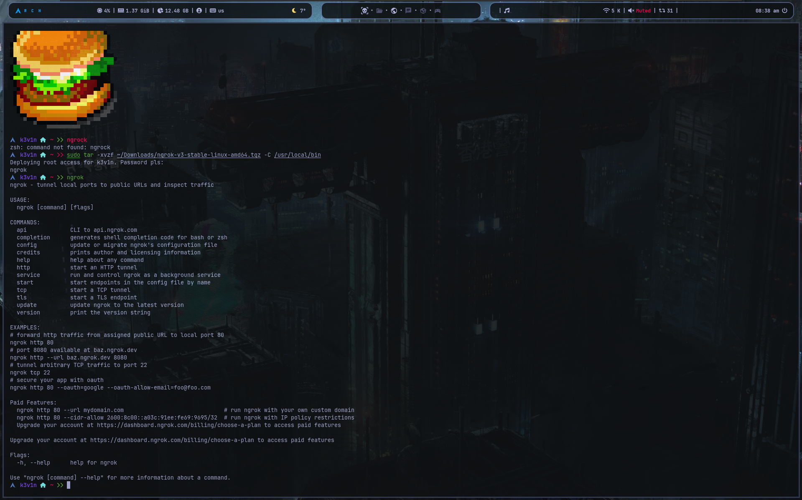
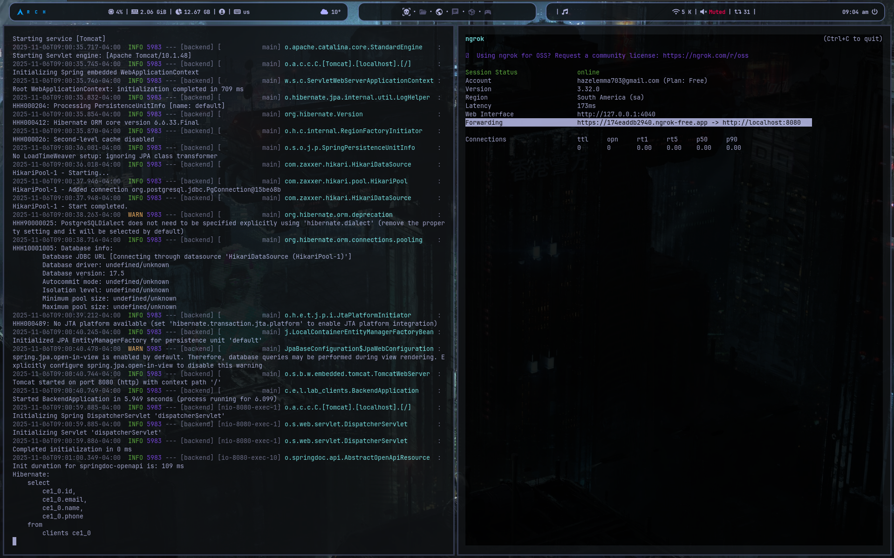
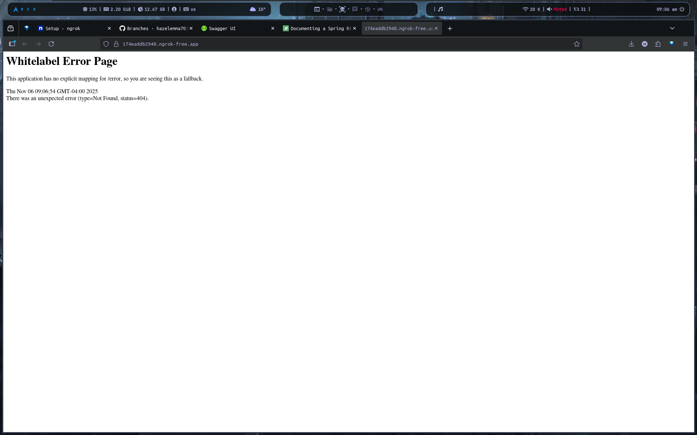
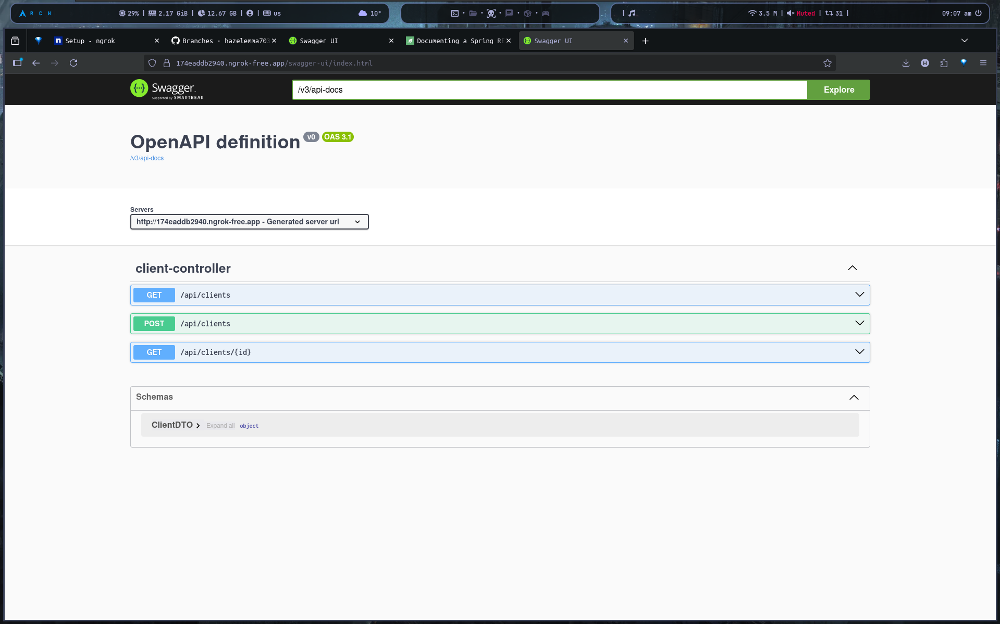

# Guía paso a paso para usar ngrok

**✅ Guía rápida:** _ngrok_ te permite exponer un servidor local a Internet mediante una URL pública segura. En pocas líneas de comando puedes compartir tu aplicación, probar webhooks o mostrar un demo sin necesidad de configurar DNS, puertos o firewalls.

---

## 📝 Guía paso a paso para usar **ngrok**

### 1. Registro e instalación


> En mi caso no tengo ngrok instalado, así que empezaré desde cero.

- En un navegador web, ve a [ngrok.com](https://ngrok.com/) y regístrate.


> Haz clic en "Sign up" para crear una cuenta gratuita y sigue todo el proceso de registro. Tambien puedes registrarte usando tu cuenta de GitHub o Google.


> En mi caso ya tengo una cuenta, así que iré directamente al panel de control.

- **Crea una cuenta gratuita** en [ngrok.com](https://ngrok.com/).
- Descarga el binario de ngrok para tu sistema operativo (Windows, macOS, Linux).


> Selecciona la opción en base a tu S.O de tu máquina.


> Haz clic en el enlace de descarga para obtener el archivo comprimido, es decir en `Microsoft Store Installer` para Windows o si usa macOS o Linux selecciona la plataforma correspondiente y descarga ejecutando los comandos que te sugiere la web.


> Una vez descargado el archivo comprimido, considero que no deberías de tener ningún problema con el proceso de instalación, considero que es bastante sencillo.

- Descomprime el archivo y coloca el ejecutable en una carpeta incluida en tu `PATH` (ej. `/usr/local/bin` en Linux o `C:\ngrok` en Windows).

> El paso de descompresión y colocación del ejecutable en una carpeta incluida en tu `PATH` dependerá de tu sistema operativo, pero generalmente es un proceso sencillo y en muchos casos es un proceso automático en windows pero en macOS o Linux puede que tengas que hacerlo manualmente.

### Verificación de instalación



> Abre una terminal y ejecuta el siguiente comando para verificar que ngrok está instalado correctamente:

```bash
ngrok version

# o solo
ngrok
```

### 2. Autenticación

- Una vez registrado, en tu panel verás un **Authtoken**.
- Copia ese token y ejecútalo en tu terminal:
  ```bash
  ngrok config add-authtoken TU_AUTHTOKEN
  ```
- Esto vincula tu instalación local con tu cuenta de ngrok.


> Reemplaza `TU_AUTHTOKEN` con el token que copiaste de tu panel de ngrok.

Si todo está correcto, verás un mensaje de confirmación.

```bash
Authtoken saved to configuration file: /home/usuario/.ngrok2/ngrok.yml
```

> Bien ya tenemos ngrok instalado y autenticado con nuestra cuenta, ahora podemos empezar a usarlo.

### 3. Inicia tu servidor local

- SEjecutamos una aplicación local. Por ejemplo, en spring boot:
  ```bash
  ./mvnw spring-boot:run
  ```
  > Esto iniciará tu aplicación en `http://localhost:8080` (o el puerto que uses).


> Asegúrate de que tu servidor local esté corriendo antes de exponerlo con ngrok.


> Pero hasta ahora no hemos expuesto nuestra aplicación a Internet, por ahora nuestra aplicación sigue siendo local, para eso usaremos ngrok.

### 4. Exponer el servidor local

- Abre tu terminal y ejecuta:
  ```bash
  ngrok http 8080
  ```
- ngrok creará un túnel seguro y te dará una **URL pública** (ej. `https://abcd1234.ngrok.io`).


> Ahora ngrok está corriendo y exponiendo tu servidor local a Internet.



> Copia la URL pública que ngrok te proporciona, esta se encuentra en la sección `Forwarding`.


> Al ingresar a la URL pública en un navegador, veras un mensaje de advertencia de seguridad, esto es normal ya que ngrok usa un certificado SSL autofirmado, solo debes aceptar el riesgo haciendo clic en `Visit Site`.
> Ten en cuenta que la URL pública cambiará cada vez que inicies ngrok, a menos que uses un plan de pago con subdominios personalizados.



> ya podemos acceder a nuestra aplicación local desde cualquier parte del mundo usando la URL pública que ngrok nos proporciona, tambien puedes navegar por las diferentes rutas de tu aplicación.



### 4. Compartir y probar

- Usa esa URL para compartir tu aplicación con clientes, compañeros o para recibir webhooks.
- Cada petición que llegue a la URL pública será redirigida a tu servidor local.
- Prueba accediendo a la URL desde otro dispositivo o compartiéndola con alguien más.
  

  

---
