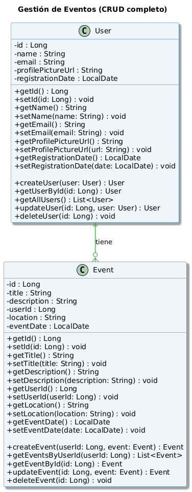

## 🧪 Laboratorio: Mini sistema de gestión de eventos

## 🌟 Objetivo

Construir una aplicación web funcional donde los estudiantes puedan:

1. Registrar usuarios.
2. Crear eventos asociados a un usuario.
3. Listar los eventos de un usuario en particular.

Este laboratorio está diseñado para realizarse en un máximo de 2 horas.

---

## ⚙️ Tecnologías

- **Backend**: Java 21+, Spring Boot (Spring Web).
- **Frontend**: React 19 con Next.js 15.
- **Comunicación**: JSON vía fetch/Axios.

---

## 🔨 Alcance funcional

### Backend - Spring Boot

| Método | Ruta | Descripción |
| --- | --- | --- |
| POST | `/users` | Crear nuevo usuario |
| GET | `/users/{id}/events` | Obtener eventos del usuario |
| POST | `/users/{id}/events` | Crear evento para un usuario específico |

### Modelo `User`

- `id`: Long
- `name`: String

### Modelo `Event`

- `id`: Long
- `title`: String
- `description`: String
- `userId`: Long (referencia al usuario)



---

## **Endpoints Disponibles**

### **Usuarios**

- **`POST /api/users`** - Crear un nuevo usuario
- **`GET /api/users`** - Obtener todos los usuarios
- **`GET /api/users/{id}`** - Obtener un usuario por ID
- **`PUT /api/users/{id}`** - Actualizar un usuario
- **`DELETE /api/users/{id}`** - Eliminar un usuario

### **Eventos**

- **`POST /api/users/{userId}/events`** - Crear un nuevo evento para un usuario
- **`GET /api/users/{userId}/events`** - Obtener todos los eventos de un usuario
- **`GET /api/users/{userId}/events/{eventId}`** - Obtener un evento por ID
- **`PUT /api/users/{userId}/events/{eventId}`** - Actualizar un evento
- **`DELETE /api/users/{userId}/events/{eventId}`** - Eliminar un evento

---

### Frontend - Next.js

### Funcionalidades

1. **Página principal** (`/users`):
    - Lista de usuarios.
    - Formulario para registrar nuevo usuario.
2. **Página de usuario** (`/users/[id]`):
    - Lista de eventos del usuario.
    - Formulario para crear nuevo evento.

> Utilizar fetch o axios para conectarse al backend. Se recomienda usar el enrutamiento dinámico de Next.js para /users/[id].
> 

---

## 🧐 Conceptos que se pondrán en práctica

| Backend | Frontend |
| --- | --- |
| Rutas RESTful con parámetros | Páginas dinámicas con rutas (`[id].tsx`) |
| Validación básica (campos vacíos) | Manejo de estado local con hooks |
| Relaciones (usuario-evento) | Forms controlados y envío de datos |
| DTOs / separación de modelos | Navegación entre vistas usando Next.js |

---

## ⏱️ Cronograma sugerido (2 horas)

| Tiempo | Actividad |
| --- | --- |
| 0-15m | Crear entidades y endpoints en Spring Boot |
| 15-30m | Implementar lógica de negocio |
| 30-40m | Probar API con Postman o curl |
| 40-60m | Crear frontend base con Next.js |
| 60-90m | Implementar vista de usuarios y eventos |
| 90-120m | Pruebas, mejoras, entrega de evidencias |

---

## 📂 Estructura esperada

### Backend:

```
src/
├─ controller/
│  ├─ UserController.java
│  └─ EventController.java
├─ model/
│  ├─ User.java
│  └─ Event.java
└─ service/
   └─ EventService.java

```

### Frontend (Next.js):

```
pages/
├─ users/
│  └─ [id].tsx       <- Vista de eventos del usuario
├─ index.tsx         <- Vista de usuarios
components/
├─ UserForm.tsx
├─ EventForm.tsx

```

---

## 🔀 Extras opcionales

- Filtro por nombre de evento.
- Validaciones en el frontend.
- Indicadores de carga (spinners).
- Alerta de éxito/error tras enviar formularios.

---

## 📄 Entregables

- Código fuente del backend y frontend (repositorio Git).
- Captura de pantalla con:
    - Lista de usuarios.
    - Lista de eventos de un usuario.
- Respuestas a estas preguntas:
    1. ¿Cómo se comunican React y Spring Boot?
    2. ¿Qué retos enfrentaste al hacer la integración?