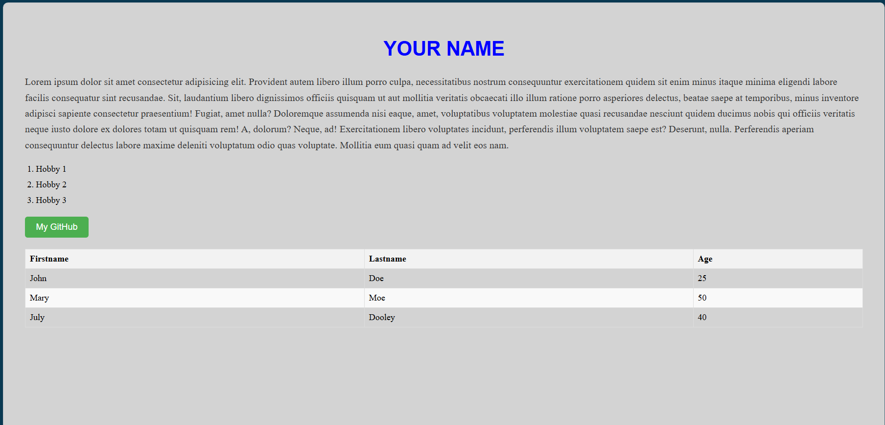

---

# 📘 Evaluación Diagnóstica – Desarrollo Web y Java (solucionado)

**Duración:** 2 horas  
**Distribución:**

- Parte Teórica: 20% (20 puntos)
    
- Parte Práctica: 80% (80 puntos)
    
- Puntuación Total: 100 puntos
    

---

## **Parte Teórica (20 puntos, ~30 min)**

### **Sección A: Desarrollo Web (10 puntos)**

1. (1 pts) ¿Qué diferencia existe entre HTML, CSS y JavaScript en una página web?

    Este es el `stack` de tecnologías que se usa en el desarrollo web es la base
    - `HTML`: nos permite hacer la maquetación de la página (el esqueleto)
    - `CSS`: se usa para que la página web tenga estilos, es decir la parte visual
    - `JS`: se encarga de la funcionalidad de la página web.
    
2. (1 pts) Menciona todas las etiquetas HTML que conoce y de una descripción de al menos 3 de ellas:

    - `div`
    - `section`
    - `aside`
    - `h1-h6`
    - `span`
    - `article`
    - `script`
    
3. (2 pts) ¿Qué es un "atributo" en HTML? Da un ejemplo.

    Un atributo es aquella que se le pasa a una etiqueta `html` en la apertura de la misma ej: `<div class=""></div>`
    
4. (2 pts) ¿Qué diferencia hay entre `id` y `class` en etiquetas HTML y como se usan en CSS?

    - `id`: se usa para asignar un identificador único a etiquetas HTML
    - `class`: permite agrupar muchas etiquetas HTML con una sola palabra
	   
5. (2 pts) ¿Qué es un archivo externo `.css` y por qué es recomendable usarlo?

    Es un archivo de estilos, usado para poder trabajar de una manera ordenada, es el lugar donde definimos todos los estilos de nuestra página web para luego enlazarlo a un archivo `.html`
    
    

### **Sección B: Java (10 puntos)**

1. (1 pts) ¿Qué significa que Java es un lenguaje "orientado a objetos"?

    Indica que nos soporta el paradigma POO, lo cual se enfoca en trabajar u organizar los datos y comportamientos en estructuras que se conocen como objetos, al seguir este enfoque se garantiza que el software que se desarrolla es modular, escalable y mantenible.
    
2. (1 pts) Explica qué es la JVM (Java Virtual Machine).

    Java funcion bajo el concepto `WORA` lo cual dignifica `Write once, run anywhere` (Escribe una vez, corre en cualquier lugar), una vez que nuestro codigo es compilado a `bytecode` con la JVM  que es la maquina virtual de java, podemos ejecutar nuestros programas en cualquier sistema.
    
3. (2 pts) Nombra los cuatro modificadores de acceso en Java y su alcance.

    - public: Accesible desde cualquier clase, sin importar el paquete.
    - protected: Accesible desde el mismo paquete y desde subclases, incluso en otros paquetes.
    - default: Accesible solo dentro del mismo paquete. También se llama package-private.
    - private: Accesible solo dentro de la misma clase donde se declara.

    
4. (1 pts) ¿Qué es una variable y cómo se declara en Java?

    Una variable es donde nosotros almacenamos datos (una cajita), estos datos se guardan de manera temporal `<tipo de dato> <nombre variable> = <valor>;` ej `int num = 16;
    
5. (1 pts) ¿Cuál es la diferencia entre `==` y `.equals()` en Java?

    - `==`: nos permite compara valores con tipos de datos primitivos
    - `.equals()`: para comparar objetos
    
6. (2 pts) ¿Qué es una **interfaz funcional** en Java? Da un ejemplo conocido.

    las interfaces funcionales con aquellas interfaces en java que solo definen un metodo abstracto tambien conocidos como `SAM` en su cuerpo. Para buenas practicas se les suele dar el decorador `@FunctionalInterface`
    Ejemplo:
    ```java
    @FunctionalInterface
    public interface Runnable{
        void run();
    }
    ```
    
7. (2 pts) ¿Para qué sirven las **expresiones lambda** (funciones anónimas) en Java?
    Son funciones anonimas que no necesitan un nombre para ser declarados
    
8. (2 pts) ¿Qué ventaja ofrecen los **genéricos** (`Generics`) en Java al momento de programar?

    Los genericos es una parigma en donde nos se nos permite declarar claes y funciones con tipos de datos parametrizados

    

---

## **Parte Práctica (80 puntos, ~90 min)**

### **Sección A: Desarrollo Web (40 puntos)**

**Ejercicio 1 (15 pts): HTML y CSS básicos**  
Crea una página sencilla que contenga:

- Un título principal con tu nombre.
    
- Un párrafo con una breve presentación.
    
- Una lista con 3 de tus hobbies.
    
- Un enlace a tu sitio favorito.
	
-  Una tabla de 2 columnas y 3 filas con datos ficticios.
    
- Dale estilo con CSS:
    
    - Fondo de color.
        
    - Títulos en otro color y centrados.
        
    - Lista con viñetas cuadradas.

- Solucionado

```html
<h1>YOUR NAME</h1>
    <P>Lorem ipsum dolor sit amet consectetur adipisicing elit. Provident autem libero illum porro culpa, necessitatibus
        nostrum consequuntur exercitationem quidem sit enim minus itaque minima eligendi labore facilis consequatur sint
        recusandae.
        Sit, laudantium libero dignissimos officiis quisquam ut aut mollitia veritatis obcaecati illo illum ratione
        porro asperiores delectus, beatae saepe at temporibus, minus inventore adipisci sapiente consectetur
        praesentium! Fugiat, amet nulla?
        Doloremque assumenda nisi eaque, amet, voluptatibus voluptatem molestiae quasi recusandae nesciunt quidem
        ducimus nobis qui officiis veritatis neque iusto dolore ex dolores totam ut quisquam rem! A, dolorum? Neque, ad!
        Exercitationem libero voluptates incidunt, perferendis illum voluptatem saepe est? Deserunt, nulla. Perferendis
        aperiam consequuntur delectus labore maxime deleniti voluptatum odio quas voluptate. Mollitia eum quasi quam ad
        velit eos nam.</P>

    <ol>
        <li>Hobby 1</li>
        <li>Hobby 2</li>
        <li>Hobby 3</li>
    </ol>

    <a href="https://github.com/KEVIN-117">
        <button>My GitHub</button>
    </a>

    <table>
        <thead>
            <tr>
                <th>Firstname</th>
                <th>Lastname</th>
                <th>Age</th>
            </tr>
        </thead>
        <tbody>
            <tr>
                <td>John</td>
                <td>Doe</td>
                <td>25</td>
            </tr>
            <tr>
                <td>Mary</td>
                <td>Moe</td>
                <td>50</td>
            </tr>
            <tr>
                <td>July</td>
                <td>Dooley</td>
                <td>40</td>
            </tr>
        </tbody>
    </table>
```

```css
<style>

        body {
            background-color: lightgray;
            margin: 20px;
            padding: 20px;
        }

        h1 {
            color: blue;
            text-align: center;
            font-family: Arial, sans-serif;
            font-size: 36px;
        }

        p {
            font-family: 'Times New Roman', Times, serif;
            font-size: 18px;
            line-height: 1.6;
            color: #333;
        }

        ol {
            margin: 20px 0;
            padding-left: 20px;
        }

        li {
            margin-bottom: 10px;
            font-size: 16px;
        }

        button {
            background-color: #4CAF50;
            color: white;
            padding: 10px 20px;
            border: none;
            border-radius: 5px;
            cursor: pointer;
            font-size: 16px;
        }

        button:hover {
            background-color: #45a049;
        }

        table {
            width: 100%;
            border-collapse: collapse;
            margin-top: 20px;
        }

        th, td {
            border: 1px solid #ddd;
            padding: 8px;
            text-align: left;
        }

        th {
            background-color: #f2f2f2;
        }

        tr:nth-child(even) {
            background-color: #f9f9f9;
        }
        tr:hover {
            background-color: #ddd;
        }
    </style>
```

- Resultado


	
**Ejercicio 2 (25 pts): Página con formulario**  
Agrega a la página un **formulario sencillo** con:
	
- Un campo de texto para el nombre.
    
- Un campo de correo electrónico.
    
- Una lista desplegable con tres opciones de carrera universitaria.
    
- Un botón para enviar.
	
	> No es necesario que funcione el envío, solo la estructura y el estilo.

- Solucionado

```html
<form action="">
        <label for="name">Name:</label>
        <input type="text" id="name" name="name" required>
        <br><br>
        <label for="email">Email:</label>
        <input type="email" id="email" name="email" required>
        <br><br>
        <label for="degree">Degree:</label>
        <select id="degree" name="degree" required>
            <option value="">Select your degree</option>
            <option value="bachelors">Bachelor's</option>
            <option value="masters">Master's</option>
            <option value="phd">PhD</option>
        </select>
        <br><br>
        <button type="submit">Submit</button>
    </form>
```

---

### **Sección B: Java (40 puntos)**

**Ejercicio 1 (10 pts): Variables y condicionales**  
Escribe un programa en Java que:

- Pida la edad de un usuario.
    ```java
    Scanner sc = new Scanner(System.in);
    int age = sc.nextInt();
    ```
    
- Si es menor de 18, imprima: _"Eres menor de edad"_.
    ```java
    if(age < 18){
        System.out.println("Eres menor de edad");
    }
    ```
    
- Si es 18 o más, imprima: _"Eres mayor de edad"_.
    ```java
    else {
        System.out.println("Eres mayor de edad");
    }
    ```
    

**Ejercicio 2 (10 pts): Clases y métodos**  
Crea una clase `Estudiante` con los siguientes atributos:

- `nombre` (String)
    
- `edad` (int)
    
- `carrera` (String)
    
    ```java
    public class Estudent{
        private String name;
        private Integer age;
        private String degree;
    }
    ```

La clase debe tener:

- Un constructor para inicializar los valores.
    ```java
    public Estudent(String name, Integer age, String degree){
        this.name = name;
        this.age = age;
        this.degree = degree;
    }
    ```
    
- Un método `presentarse()` que imprima:
    
    > "Hola, me llamo [nombre], tengo [edad] años y estudio [carrera]."

    ```java
    public void take(){
        System.out.println("Hola, me llamo" + this.name +" tengo "+ this.edad + " años y estudio " + this.degree);
    }
    ```
    
	En la clase principal (`Main`), crea dos estudiantes y haz que se presenten.

    ```java
    Estudent est1 =  new Estudent("alguien", 23, "Ciencias de la computacion");
    Estudent est2 =  new Estudent("alguien", 23, "Desarrollo de software");

    est1.take();
    est2.take();
    ```


**Ejercicio 3 (20 pts): Programación orientada a objetos, funcional y genérica**

1. Crea una clase `Producto` con atributos: `nombre` (String) y `precio` (double).

```java
public class Product{
    private String name;
    private Double price;

    public Product(String name, Double price){
        this.name = name; 
        this.price = price; 
    }

    // getters y setters
}
```
    
2. Crea una lista de varios productos en la clase principal (`Main`).

```java
List<Product> products = new ArrayList<>();
```
    
3. Utiliza una **expresión lambda** para filtrar e imprimir solo los productos cuyo precio sea mayor a 50.

```java
products.Stream.filter(product -> {
    if(product.getPrice() > 50){
        return product
    }
});
```
4. Crea una clase genérica `Caja<T>` que permita guardar un objeto de cualquier tipo.

- Debe tener un método `guardar(T objeto)` y `obtener()` que devuelva el objeto.

    ```java
    public class Box<T>{
        private T obj
        public void save(T obj){
            this.obj = obj;

        }

        public T get(){
            return this.obj;
        }
    }
    ```
    
        
    - En `Main`, guarda un objeto `Producto` en una `Caja` y luego recupéralo para mostrarlo en consola.
    
    ```java
    Box<Product> box =  new Box<>();
    Product product1 = new Product("Milk", 12.5);
    box.save(product1);
    Product product2 = box.get();

    System.out.println(product2);
    ```
---


!!! note "✅ Con esta evaluación"
    Nos permitirá ver desde donde debemos iniciar:

    - En **web**, validas si saben estructurar y dar estilo, sin necesidad de entrar en lógica compleja de JS.
    - En **Java**, verificas si entienden lo básico (POO), y también si han escuchado o trabajado algo de **funcional** (lambdas) y **genérico** (clases genéricas).


## Entregable

Debera generar archivos con la extencion correspondiente:

- para las preguntas teoricas en un archivo `.txt`
- para las preguntas practicas
    - web: `.html` y `.css`
    - java: `.java`

Para la entrega de la misma debera seguir los siguientes pasos

1. Debe crear un reposirotrio en github en su cuenta
2. Ejecute los siguientes comando en la terminal de su preferencia:
```
git init --initial-branch=main # inicializamos la rama
git add .
git remote add origin <url> # la url lo encuentra en la web de GitHub en el lugar donde llego a crear su repo
git commit -m "parctica 0 <su nombre>"
git push -u origin main
```

Estos son todo los pasos de para entregar su tarea.

---
!!! warning "🤖 Tomen en cuenta"
    - La practica solo se revisara de las personas que tenga asistencia en la fecha en la que se dio esta prueba
    - Es obligatorio que este en GitHub.


# 📘 Evaluación Diagnóstica – Desarrollo Web y Java (Miercoles)

**Duración:** 2 horas
**Distribución:**

* Parte Teórica: 20% (20 puntos)
* Parte Práctica: 80% (80 puntos)
* Puntuación Total: 100 puntos

---

## **Parte Teórica (20 puntos, \~30 min)**

### **Sección A: Desarrollo Web (10 puntos)**

1. (1 pts) ¿Qué es una etiqueta semántica en HTML y por qué es importante?
2. (1 pts) Menciona 5 etiquetas de formulario (`form`) y explica la utilidad de 2 de ellas.
    - input:
    - label:
    - button:
    - 
3. (2 pts) ¿Cuál es la diferencia entre etiquetas en bloque (*block*) y en línea (*inline*) en HTML? Da un ejemplo de cada una.
    La diferencia se da en comom estas etiquetas se pocicionan, en el caso de las *inline* estas se acomodan una al lado de otro, mientras que las de *block* se apilan una debajo de otra 
4. (2 pts) ¿Qué diferencia existe entre `inline-style`, `<style>` interno y un archivo `.css` externo?
    La diferencia es clara:
    - las `inline-style` se especifican directamente en la etiqueta, justo en la de apertura se utiliza el atributo `style`
    - las `<style>` se situan en la seccion de los metadatos del archivo `.html`
    - el `.css` esterno es un archivo independiente con extencion `.css`, posteriormente esta es enlazada al archivo html
5. (2 pts) Explica la diferencia entre id y class en CSS y en qué caso usarías cada uno.
    - Id: un solo identofocadora para una etiqueta
    - class: para poder generalizar y agrupar a muchos elementos
6. (2 pts) ¿Qué diferencia existe entre HTML, CSS y JavaScript en una página web?
    - HTML: define la estructura de la pagina web
    - CSS: son los estilos de la pagina web, permite trabajar en lo visual, es decir el aspecto
    - js: es la fincionalidad de la pagina web

---

### **Sección B: Java (10 puntos)**

1. (1 pts) ¿Qué es una clase en Java y qué elementos puede contener?

    - podriamos definirlo como una plantilla que nos permite crear objetos, estas pueden contener atributos (especificaciones) y metodos (acciones)

2. (1 pts) ¿Qué es un constructor y cómo se diferencia de un método normal?

    - Un constructor es una metodo especial que tiene una clase, se usa para poder inicializar los tributos de la clase al momento de instanciar o crear un nuevo objeto

3. (2 pts) Explica con tus palabras qué significa herencia en Java.

    Herencia nos permite simular una estructura tipo jerarquica, es decir nos permite generalizar clases de esta manera poder trabajara con Super clase y sub clases

4. (2 pts) ¿Qué es un `ArrayList` y en qué se diferencia de un arreglo (`array`) normal en Java?

    - Un `ArrayList` es es una lista dinamica es una implementacion de `java.util`, su diferencia con un `array` normal es que esta una vez creada no se puede modificar en tamaño, entonces la diferencia es `ArrayList` es dinamico, `array` es estatico.

5. (2 pts) Explica qué es una expresión *lambda* en Java y escribe un ejemplo corto.

    - Son funciones anonimas que no necesitan un nombre para ser declarados

6. (2 pts) ¿Para qué sirven los **genéricos** en Java? Da un ejemplo de colección genérica.

    - Los genericos es una parigma en donde nos se nos permite declarar claes y funciones con tipos de datos parametrizados

---

## **Parte Práctica (80 puntos, \~90 min)**

### **Sección A: Desarrollo Web (40 puntos)**

**Ejercicio 1 (15 pts): Página con estructura básica**
Crea una página que contenga:

* Un encabezado (`<header>`) con el título "Mi Página Personal".
* Una sección (`<section>`) con un párrafo de presentación y una imagen cualquiera.
* Una lista no ordenada con tres metas personales.
* Un pie de página (`<footer>`) con tu correo electrónico.

Dale estilo con CSS:

* Fondo claro.
* Encabezado con texto centrado y color de fondo distinto.
* Párrafo con interlineado de 1.5.
* Lista con viñetas circulares.

```html
<header>
    <h1>Mi pagina Personal</h1>
</header>

<section>
    <p>
        esta es mi presentacion, debe ser un texto largo pero no tengo nada que decir <b>sin comentarios<b/>
    </p>
    

    <ul>
        <li>meta 1</li>
        <li>meta 2</li>
        <li>meta 3</li>
    </ul>
</section>

<footer>
    <span>alguien@example.com</span>
</footer>
```

```css
body{
    background-color: white;
}

header{
    max-width: 90%;
    display: flex;
    justify-content: center;
    aling-items: center;
    background-color: rgba(10, 20, 100, 0.5);
}
```

---

**Ejercicio 2 (25 pts): Formulario con estilos**
Agrega un formulario con:

* Un campo de texto para el nombre.
* Un campo de contraseña.
* Una casilla de verificación para aceptar términos y condiciones.
* Un botón para enviar.

Con CSS:

* Botón con color de fondo azul y texto blanco.
* Campos con borde redondeado.
* Que al pasar el mouse sobre el botón cambie a color verde.

---

### **Sección B: Java (40 puntos)**

**Ejercicio 1 (10 pts): Condicionales y bucles**
Escribe un programa que:

* Pida un número al usuario.
* Imprima todos los números pares desde 0 hasta ese número.

```java
class Main{
    public static void main(String[] args){
        Scanner sc = new Scanner(System.in);
        int number = sc.nextInt();

        int count = 0;
        while(count++ <= number){
            if(count % 2 == 0)
                System.out.println(count);
        }
    }
}
```

---

**Ejercicio 2 (10 pts): Clases y objetos**
Crea una clase `Libro` con atributos:

* `titulo` (String)
* `autor` (String)
* `anio` (int)

La clase debe tener:

* Un constructor para inicializar.
* Un método `mostrarInfo()` que imprima los datos del libro.

En la clase principal (`Main`), crea al menos 2 libros y muestra su información.

```java
class Book{
    private String title;
    private String author;
    private Integer age;

    public Book(String title, String author, Integer age){
        this.title = title;
        this.author = author;
        this.age = age;
    }

    public void getData(){
        System.out.println("Datos del libro")
        System.out.println("Titulo: " + this.title)
        System.out.println("Autor: " + this.author)
        System.out.println("Anio de publicacion: " + this.age)
    } 

    public static vois main(String[] args){
        Book book1 = new Book("Libro 1", "alguien 1", "2000");
        Book book2 = new Book("Libro 2", "alguien 2", "2001");
        book1.getData();
        book2.getData();
    }
}

```

---

**Ejercicio 3 (20 pts): POO + Funcional + Genéricos**

1. Crea una clase `Alumno` con atributos: `nombre` y `nota`.
2. Crea una lista de alumnos en `Main`.
3. Con una **expresión lambda y Streams**, filtra e imprime solo los alumnos con nota mayor o igual a 60.
4. Implementa una clase genérica `Contenedor<T>` que pueda guardar cualquier tipo de objeto.

   * Debe tener métodos `guardar(T objeto)` y `obtener()`.
   * En `Main`, guarda un `Alumno` en un `Contenedor` y luego recupéralo.

```java
class Student {
    private String name;
    private Double grade;

    public Student(String name, Double grade){
        this.name = name;
        this.grade = grade;
    }

    // getters and setters
    
}

public class Box<T>{

    private T obj;

    public Box(){}

    public void save(T obj){
        this.obj = obj;
    }

    public T get(){
        return this.obj;
    }
} 

public class Main{
    public static void main(String[] args){
        List<Student> students = new ArrayList<>();
        students.stream.filter(std -> std.getGrade() > 60).map(System.out::println);

        Box<Student> box1 = new Box<>();
        box1.save(new Student("Alguien", 100));

        System.out.println(box1.get());
    }
}
```

---

## 📦 Entregable

* Teoría: en un archivo `.txt`
* Desarrollo Web: en archivos `.html` y `.css`
* Java: en archivos `.java`

Entrega en GitHub siguiendo los mismos pasos:

```bash
git init --initial-branch=main
git add .
git remote add origin <url-del-repo>
git commit -m "diagnostico <tu-nombre>"
git push -u origin main
```

---

Estos son todo los pasos de para entregar su tarea.

---
!!! warning "🤖 Tomen en cuenta"
    - La practica solo se revisara de las personas que tenga asistencia en la fecha en la que se dio esta prueba
    - Es obligatorio que este en GitHub.
